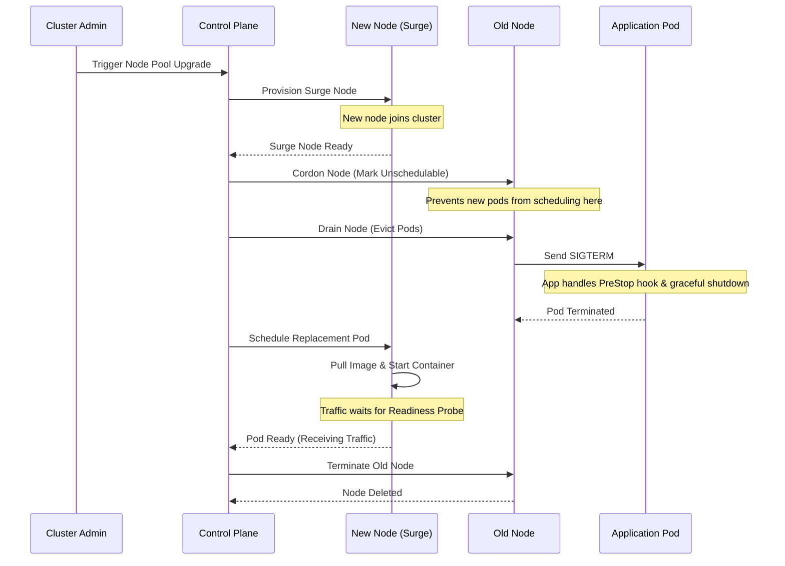

# Lesson 13: Zero-Downtime Cluster Upgrades

Upgrading a Kubernetes cluster is a critical administrative task that, if not done correctly, can lead to application downtime and disrupted services. Understanding how to perform zero-downtime upgrades is essential for maintaining high availability.

This lesson covers the concepts and best practices for upgrading a Kubernetes cluster (both Control Plane and Worker Nodes) without impacting your running applications.

## 1. Upgrading the Control Plane

The Control Plane components (API Server, Controller Manager, Scheduler, etcd) orchestrate the cluster. In managed services like Google Kubernetes Engine (GKE), Amazon EKS, or Azure AKS, the control plane is managed by the cloud provider.

- **Managed Clusters (GKE/EKS/AKS):** You typically trigger a control plane upgrade via the cloud console or CLI. The provider handles rolling out the new components seamlessly.
- **Self-Managed Clusters (kubeadm):** You must upgrade `kubeadm`, run `kubeadm upgrade apply`, and then upgrade the `kubelet` and `kubectl` on the master nodes one by one.

*Note:* Upgrading the control plane does not restart your application pods, but you might temporarily lose the ability to deploy new workloads or query the API server during the upgrade.

## 2. Upgrading Worker Nodes

Worker nodes run your actual application Pods. Upgrading nodes requires replacing the underlying VMs or updating the software (kubelet, container runtime) on them. This is where your applications are at risk of downtime.

### Node Upgrades Strategies

1. **Surge Upgrades (Rolling Update):**
   A surge upgrade spins up new nodes with the updated version alongside your existing nodes. Once the new nodes are ready, workloads are migrated from the old nodes to the new ones, and the old nodes are deleted.
   - **Advantage:** Maintains application capacity during the upgrade.
   - **Requirement:** You need enough quota and IP addresses for the extra nodes during the surge.

2. **Blue/Green Node Pools:**
   Create an entirely new node pool with the target version. Cordon and drain the old node pool to migrate workloads to the new one, and then delete the old node pool.
   - **Advantage:** Gives you full control and allows you to test the new nodes before migrating traffic.

## 3. Protecting Your Workloads During Node Upgrades

Before you begin upgrading worker nodes, you must configure your workloads to tolerate node restarts. If you don't, Kubernetes might evict all pods of your application simultaneously.

### A. Multiple Replicas
Ensure your Deployment has multiple replicas (`replicas: > 1`). A single-replica pod will inherently experience downtime if its node is upgraded.

### B. Pod Disruption Budgets (PDB)
A Pod Disruption Budget limits the number of concurrent voluntary disruptions that your application experiences. Node drains (during an upgrade) respect PDBs.

```yaml
apiVersion: policy/v1
kind: PodDisruptionBudget
metadata:
  name: web-app-pdb
spec:
  minAvailable: 2
  # Or use maxUnavailable: 1
  selector:
    matchLabels:
      app: web-app
```
*If a PDB requires 2 pods to be available, Kubernetes will not drain a node if it would drop the available pods below 2. It waits until a new pod is scheduled and healthy on another node.*

### C. Graceful Shutdown (PreStop Hooks)
When a node is drained, pods are sent a `SIGTERM` signal. Your application must handle this signal to finish ongoing requests cleanly.
If your app doesn't handle `SIGTERM` properly, you can use a `preStop` hook to add a delay or run a cleanup script.

```yaml
lifecycle:
  preStop:
    exec:
      command: ["/bin/sleep","15"]
```
*See [Lesson 9](0009-resources-probes-graceful-shutdown.md) for more details on graceful shutdowns.*

### D. Readiness Probes
Readiness probes ensure that traffic is not routed to a pod until it is fully ready to handle requests. During a rolling node upgrade, this prevents the Service from sending traffic to new pods that are still initializing.

## 4. The Node Draining Process

When a node is upgraded, it undergoes the Cordon and Drain process:

1. **Cordon (`kubectl cordon <node>`):** The node is marked as "unschedulable". No new pods will be scheduled on this node.
2. **Drain (`kubectl drain <node> --ignore-daemonsets --delete-emptydir-data`):** Existing pods on the node are gracefully terminated. The Deployment controller immediately schedules replacement pods on other available nodes (such as the new surge nodes).

### Visualizing a Surge Upgrade

The following sequence diagram illustrates the step-by-step process of a zero-downtime node upgrade using the surge method:



By combining Surge Upgrades, PDBs, and Graceful Shutdowns, the cluster transitions your applications to the new Kubernetes version seamlessly without dropping user traffic.

---

[← Lesson 12: CI/CD with GitHub Actions & GKE](./0012-github-actions-cicd-gke.md) | [Lesson 14: GitOps Principles & Argo CD Fundamentals →](./0014-gitops-principles-and-argocd-fundamentals.md)
