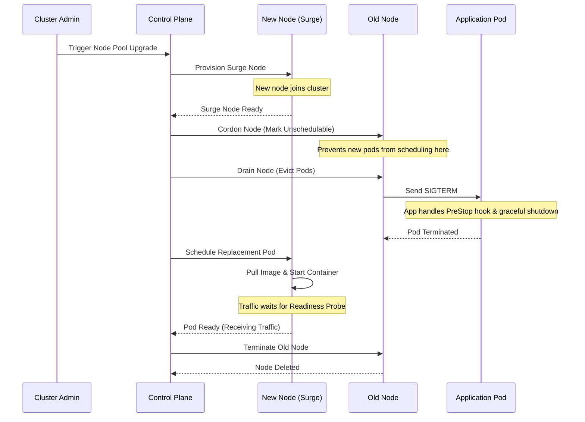

# Lesson 0013: Zero-downtime cluster upgrades

Upgrading a Kubernetes cluster involves updating both the control plane and individual worker nodes. If configured improperly, node upgrades will evict workloads prematurely and cause service outages.

This lesson covers upgrade mechanics, node pool upgrade strategies, and workload protection patterns.

---

## 1. Upgrading the control plane

The control plane components (`kube-apiserver`, `kube-controller-manager`, `kube-scheduler`, and `etcd`) manage cluster state.

- **Managed clusters (GKE/EKS/AKS):** The cloud provider orchestrates control plane upgrades in a rolling fashion across internal replicas.
- **Self-managed clusters (kubeadm):** You upgrade `kubeadm`, run `kubeadm upgrade apply`, and then upgrade `kubelet` and `kubectl` on control plane nodes one at a time.

Upgrading the control plane does not restart running application pods on worker nodes. However, API operations (`kubectl apply`, horizontal pod autoscaling, or deployment updates) will pause during master restart windows.

---

## 2. Upgrading worker nodes

Worker nodes run application containers. Upgrading nodes requires updating the node operating system, container runtime, and `kubelet`, or replacing the underlying VM instances.

### Node upgrade strategies

1. **Surge upgrades (rolling replacement):**
   Spins up new worker nodes on the target version before taking down old nodes. Workloads migrate onto the surge nodes, and once evacuated, the old nodes are deleted.
   - **Benefit:** Maintains total compute capacity during upgrades.
   - **Requirement:** Cluster VPC and cloud project quotas must accommodate the temporary surge nodes.

2. **Blue/green node pools:**
   Creates an entirely new node pool running the target version. Cordon and drain the old node pool to migrate workloads to the new pool, then delete the old pool.
   - **Benefit:** Allows testing the new node pool before migrating production traffic.

---

## 3. Protecting workloads during node upgrades

Before initiating worker node upgrades, configure workloads to handle node evictions safely.

### A. Multiple replicas
Set `replicas: 2` or higher across failure domains. A single-replica deployment will experience downtime whenever its host node drains.

### B. Pod Disruption Budgets (PDB)
A Pod Disruption Budget defines the minimum available replicas or maximum unavailable replicas during voluntary disruptions (such as node drains):

```yaml
apiVersion: policy/v1
kind: PodDisruptionBudget
metadata:
  name: web-app-pdb
spec:
  minAvailable: 2
  # Or use maxUnavailable: 1
  selector:
    matchLabels:
      app: web-app
```

When a node drain runs, the Kubernetes eviction API checks the PDB. If evicting a pod would drop available replicas below `minAvailable`, the drain waits until a replacement pod is scheduled and ready on another node.

### C. Graceful shutdown (PreStop hooks)
When a node drains, pods receive a `SIGTERM` signal. If an application takes time to flush connections or needs to wait for load balancer endpoint propagation, configure a `preStop` hook:

```yaml
lifecycle:
  preStop:
    exec:
      command: ["/bin/sleep", "15"]
```

### D. Readiness probes
Readiness probes prevent Kubernetes from routing traffic to a new pod until it completes initialization. During rolling node drains, this keeps Services from directing traffic to initializing containers.

---

## 4. The node draining process

When a node upgrades, it goes through cordon and drain steps:

1. **Cordon (`kubectl cordon <node>`):** Marks the node as unschedulable. The scheduler will not place new pods on it.
2. **Drain (`kubectl drain <node> --ignore-daemonsets --delete-emptydir-data`):** Gracefully terminates pods on the node so controllers reschedule them onto other available nodes.

### Visualizing a surge upgrade



---

[← Lesson 12: CI/CD with GitHub Actions and GKE](./0012-github-actions-cicd-gke.md) | [Lesson 14: GitOps principles and Argo CD fundamentals →](./0014-gitops-principles-and-argocd-fundamentals.md)
