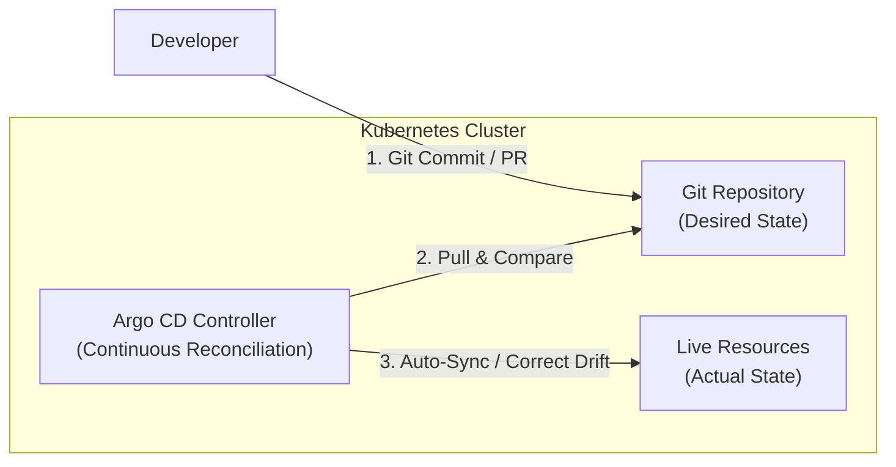
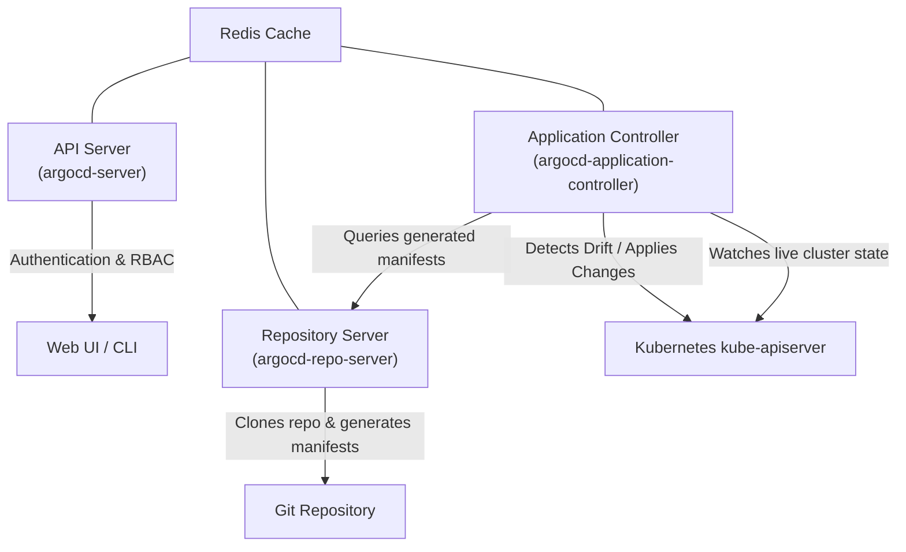
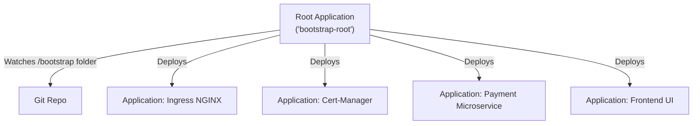

# Lesson 0014: GitOps principles and Argo CD fundamentals

## 1. What is GitOps?

**GitOps** is an operational framework that applies software development practices (version control, collaboration, compliance, and automated testing) to infrastructure automation and application delivery in Kubernetes.

In a GitOps workflow, **Git is the single source of truth** for desired system state.



### The four principles of OpenGitOps
The CNCF OpenGitOps working group defines four core principles:

1. **Declarative:** The entire system state is described declaratively through YAML manifests, Kustomize overlays, or Helm charts.
2. **Versioned and immutable:** The desired state is stored in a version control system (Git) that provides history and an immutable audit log.
3. **Pulled automatically:** Software agents running inside the cluster pull desired state from the repository.
4. **Continuously reconciled:** Reconcilers constantly observe live cluster state and apply updates to match desired state, correcting drift automatically.

---

## 2. Push versus pull CI/CD architecture

Traditional CI/CD pipelines use a **push-based** model, whereas GitOps engines (such as Argo CD and Flux) enforce a **pull-based** model.

| Feature | Push-based model (such as Jenkins or GitHub Actions) | Pull-based GitOps (such as Argo CD or Flux) |
| :--- | :--- | :--- |
| **Agent location** | Outside cluster on CI runners | Inside the Kubernetes cluster |
| **Cluster credentials** | Stored in external CI secrets | Managed internally using Kubernetes RBAC |
| **Security risk** | High blast radius if CI runner credentials leak | Narrow blast radius; no external ingress needed |
| **Drift detection** | None; manual `kubectl` edits persist | Continuous; detects manual changes and reconciles |
| **Rollback mechanism** | Trigger a new CI build | Standard `git revert` or instant Argo CD rollback |

!!! tip "Security advantages of pull-based GitOps"
    In a pull-based architecture, the Kubernetes cluster does not expose its API server to external CI systems. Firewalls remain closed to inbound traffic, and you avoid distributing cluster administrative credentials to CI runners.

---

## 3. Argo CD architecture

Argo CD runs as a set of Kubernetes controllers and API services in the `argocd` namespace:



- **`argocd-server`**: API server that powers the Web UI, CLI, SSO authentication, and RBAC policies.
- **`argocd-repo-server`**: Clones Git repositories and executes manifest generation tools (Helm, Kustomize, custom plugins).
- **`argocd-application-controller`**: Continuous reconciliation engine that compares live cluster state against rendered manifests and applies updates.
- **`argocd-dex-server`**: Provides OpenID Connect (OIDC) integration with GitHub, GitLab, Okta, Keycloak, and other identity providers.
- **`argocd-notifications-controller`**: Sends deployment notifications to Slack, Teams, email, or webhooks.

---

## 4. The Argo CD Application custom resource

In Argo CD, every deployed workload is represented as an **`Application`** Custom Resource Definition (CRD).

Below is a declarative `Application` manifest:

```yaml
apiVersion: argoproj.io/v1alpha1
kind: Application
metadata:
  name: payment-service
  namespace: argocd
  finalizers:
    - resources-finalizer.argocd.argoproj.io
spec:
  project: default
  source:
    repoURL: 'https://github.com/my-org/gitops-manifests.git'
    targetRevision: main
    path: apps/payment-service/overlays/production
  destination:
    server: 'https://kubernetes.default.svc'
    namespace: payments
  syncPolicy:
    automated:
      prune: true
      selfHeal: true
    syncOptions:
      - CreateNamespace=true
      - ApplyOutOfSyncOnly=true
    retry:
      limit: 5
      backoff:
        duration: 5s
        factor: 2
        maxDuration: 3m
```

### Key parameters
- **`finalizers: [resources-finalizer.argocd.argoproj.io]`**: Enables cascading deletion. If the `Application` CR is deleted, Argo CD deletes all child resources managed by it.
- **`targetRevision`**: The Git branch, tag, or commit hash (such as `main`, `v1.2.0`, `HEAD`).
- **`destination.server`**: Target cluster API endpoint. `https://kubernetes.default.svc` targets the in-cluster control plane.
- **`automated.prune: true`**: Removes cluster resources when their manifests are deleted from Git.
- **`automated.selfHeal: true`**: If someone manually edits or deletes a live cluster resource with `kubectl`, Argo CD restores the desired state from Git.

---

## 5. The app-of-apps pattern

When managing dozens of applications, generating individual `Application` manifests manually becomes tedious. The **app-of-apps** pattern uses a root Argo CD `Application` that points to a Git directory containing child `Application` manifests:



```yaml
# root-application.yaml
apiVersion: argoproj.io/v1alpha1
kind: Application
metadata:
  name: root-bootstrap
  namespace: argocd
spec:
  project: default
  source:
    repoURL: 'https://github.com/my-org/gitops-cluster-config.git'
    targetRevision: HEAD
    path: bootstrap/apps
  destination:
    server: 'https://kubernetes.default.svc'
    namespace: argocd
  syncPolicy:
    automated:
      prune: true
      selfHeal: true
```

---

## Test your knowledge

1. Which OpenGitOps principle guarantees that manual changes made directly via `kubectl edit` are reverted?
   - [ ] A) Declarative State Specification
   - [ ] B) Continuous State Reconciliation
   
   Answer: B. Continuous reconciliation detects drift between live cluster state and Git, triggering self-healing to restore the state declared in Git.

2. What occurs if `spec.syncPolicy.automated.prune` is set to `false` and a service manifest is deleted from Git?
   - [ ] A) The live service is deleted immediately
   - [ ] B) The live service remains in the cluster
   
   Answer: B. When pruning is disabled, Argo CD leaves orphaned resources running in the cluster rather than removing them when their manifests are deleted from source control.

---

## Hands-on practice: Installing Argo CD and deploying an application

### Step 1: Install Argo CD
```bash
# Create dedicated namespace
kubectl create namespace argocd

# Apply the official non-HA install manifests
kubectl apply -n argocd -f https://raw.githubusercontent.com/argoproj/argo-cd/stable/manifests/install.yaml

# Check all pods are Running
kubectl get pods -n argocd -w
```

### Step 2: Access the Argo CD Web UI
```bash
# Retrieve the default admin password (base64 decoded)
kubectl -n argocd get secret argocd-initial-admin-secret -o jsonpath="{.data.password}" | base64 -d; echo

# Port-forward the UI locally on port 8080
kubectl port-forward svc/argocd-server -n argocd 8080:443
```
Open `https://localhost:8080` in your browser. Log in with username `admin` and the decoded password.

### Step 3: Deploy an Application CRD declaratively
Create a file named `guestbook-app.yaml`:
```yaml
apiVersion: argoproj.io/v1alpha1
kind: Application
metadata:
  name: guestbook
  namespace: argocd
spec:
  project: default
  source:
    repoURL: https://github.com/argoproj/argocd-example-apps.git
    targetRevision: HEAD
    path: guestbook
  destination:
    server: https://kubernetes.default.svc
    namespace: guestbook
  syncPolicy:
    automated:
      prune: true
      selfHeal: true
    syncOptions:
      - CreateNamespace=true
```

Apply it to your cluster:
```bash
kubectl apply -f guestbook-app.yaml
```

### Step 4: Test self-healing drift detection
```bash
# Verify the guestbook deployment is synced
kubectl get deployment guestbook-ui -n guestbook

# Manually scale the replicas
kubectl scale deployment guestbook-ui --replicas=5 -n guestbook

# Watch Argo CD immediately reconcile it back to 1 replica
kubectl get deployment guestbook-ui -n guestbook -w
```

---

## Recommended primary resources
- [Argo CD architecture](https://argo-cd.readthedocs.io/en/stable/operator-manual/architecture/)
- [OpenGitOps standard specification](https://opengitops.dev/)

---

[← Lesson 13: Zero-downtime cluster upgrades](./0013-zero-downtime-cluster-upgrades.md) | [Lesson 15: Argo CD with Helm, Kustomize, and sync waves →](./0015-argo-helm-kustomize-sync-waves.md)
