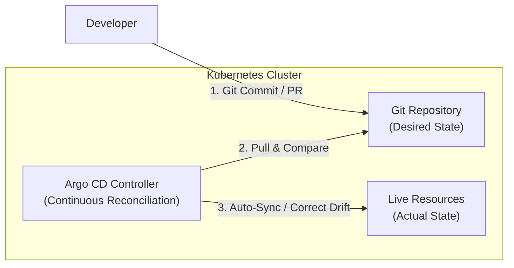
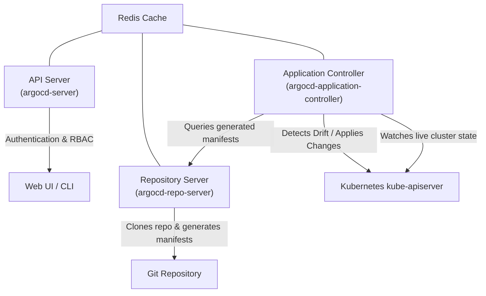
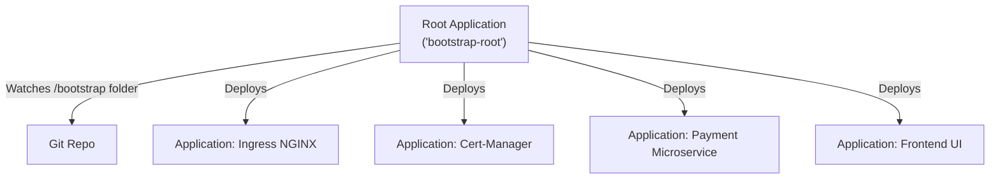

# Lesson 14: GitOps Core Principles & Argo CD Fundamentals

## 1. What is GitOps?

**GitOps** is an operational framework that takes DevOps best practices used for application development—such as version control, collaboration, compliance, and CI/CD tooling—and applies them to Kubernetes infrastructure automation and application lifecycle management.

In a GitOps workflow, **Git is the single source of truth** for the desired state of your entire system.



### The 4 Principles of OpenGitOps
The CNCF OpenGitOps working group outlines four fundamental principles:

1. **Declarative:** The entire system state must be described declaratively (e.g., Kubernetes YAML manifests, Kustomize overlays, Helm charts).
2. **Versioned & Immutable:** The desired state is stored in a version control system that supports immutability, history, and audit trails (Git).
3. **Pulled Automatically:** Software agents running inside the cluster automatically pull the desired state from the source.
4. **Continuously Reconciled:** Continuous reconcilers constantly observe the actual cluster state and apply changes to match the desired state, alerting on or correcting drift.

---

## 2. Push vs. Pull CI/CD Architecture

Traditional CI/CD pipelines use a **Push-based** model, whereas GitOps engines (like Argo CD and Flux) enforce a **Pull-based** model.

| Feature | Push-Based Model (e.g., Jenkins / GitHub Actions) | Pull-Based GitOps (e.g., Argo CD / Flux) |
| :--- | :--- | :--- |
| **Where agent runs** | Outside the cluster in CI runners | Inside the Kubernetes cluster |
| **Cluster Credentials** | Stored in external CI secrets (`kubeconfig`) | Kept internal inside the cluster using Kubernetes RBAC |
| **Security Risk** | High blast radius if CI runner is compromised | Highly secure; no external administrative ingress required |
| **Drift Detection** | None; changes made via `kubectl` persist silently | Continuous; detects manual changes instantly and reconciles |
| **Rollback Mechanism** | Trigger a new CI build or manual pipeline step | Standard `git revert` or instant one-click Argo CD rollback |

!!! tip "Security Advantage of GitOps"
    In a pull-based architecture, your Kubernetes cluster does not expose its API server to external CI systems. Firewalls remain closed to inbound traffic, and you never need to distribute long-lived admin `kubeconfig` tokens to third-party CI runners.

---

## 3. Argo CD Architecture

Argo CD is implemented as a set of Kubernetes controllers and API services running in the `argocd` namespace:



- **`argocd-server`**: The gRPC/REST API server that powers the Web UI, CLI, and handles Single Sign-On (SSO) authentication and RBAC.
- **`argocd-repo-server`**: An internal service that clones Git repositories and executes manifest generation tools (Helm, Kustomize, Ksonnet, custom plugins).
- **`argocd-application-controller`**: The continuous reconciliation engine. It compares the live state in the cluster with the manifests rendered by the repo-server and executes sync operations.
- **`argocd-dex-server`**: Provides OpenID Connect (OIDC) identity integration with GitHub, GitLab, Okta, Keycloak, etc.
- **`argocd-notifications-controller`**: Sends real-time notifications on deployment events to Slack, Teams, email, or webhooks.

---

## 4. The Argo CD `Application` Custom Resource

In Argo CD, every deployed workload is represented as an **`Application`** Custom Resource Definition (CRD).

Here is a production-ready declarative `Application` manifest:

```yaml
apiVersion: argoproj.io/v1alpha1
kind: Application
metadata:
  name: payment-service
  namespace: argocd
  finalizers:
    - resources-finalizer.argocd.argoproj.io
spec:
  project: default
  source:
    repoURL: 'https://github.com/my-org/gitops-manifests.git'
    targetRevision: main
    path: apps/payment-service/overlays/production
  destination:
    server: 'https://kubernetes.default.svc'
    namespace: payments
  syncPolicy:
    automated:
      prune: true
      selfHeal: true
    syncOptions:
      - CreateNamespace=true
      - ApplyOutOfSyncOnly=true
    retry:
      limit: 5
      backoff:
        duration: 5s
        factor: 2
        maxDuration: 3m
```

### Key Parameters Explained:
- **`finalizers: [resources-finalizer.argocd.argoproj.io]`**: Ensures cascading deletion. If the `Application` CR is deleted, Argo CD deletes all child Kubernetes resources managed by it.
- **`targetRevision`**: The Git branch, tag, or commit hash (e.g., `main`, `v1.2.0`, `HEAD`).
- **`destination.server`**: Target cluster API endpoint. `https://kubernetes.default.svc` targets the in-cluster control plane where Argo CD is hosted.
- **`automated.prune: true`**: Automatically removes Kubernetes resources from the cluster when their YAML files are deleted from the Git repository.
- **`automated.selfHeal: true`**: If a developer manually edits or deletes a live cluster resource using `kubectl`, Argo CD immediately overrides the change and restores the desired state from Git.

---

## 5. The "App of Apps" Pattern

When managing dozens of applications, creating individual `Application` manifests manually becomes tedious. The **App of Apps** pattern uses a root Argo CD `Application` whose sole purpose is to watch a Git folder containing child `Application` manifests:



```yaml
# root-application.yaml
apiVersion: argoproj.io/v1alpha1
kind: Application
metadata:
  name: root-bootstrap
  namespace: argocd
spec:
  project: default
  source:
    repoURL: 'https://github.com/my-org/gitops-cluster-config.git'
    targetRevision: HEAD
    path: bootstrap/apps
  destination:
    server: 'https://kubernetes.default.svc'
    namespace: argocd
  syncPolicy:
    automated:
      prune: true
      selfHeal: true
```

---

## Test Your Knowledge

1. Which OpenGitOps principle guarantees that manual changes made directly via `kubectl edit` are reverted?
   - [ ] A) Declarative State Specification
   - [ ] B) Continuous State Reconciliation
   
   *Answer:* B) Continuous State Reconciliation - Correct! Continuous reconciliation detects drift between live cluster state and Git, automatically triggering self-healing to restore the state defined in Git.

2. What occurs if `spec.syncPolicy.automated.prune` is set to `false` and a service manifest is deleted from Git?
   - [ ] A) The live service is deleted immediately
   - [ ] B) The live service remains in the cluster
   
   *Answer:* B) The live service remains in the cluster - Correct! When pruning is disabled, Argo CD leaves orphaned resources running in the cluster rather than deleting them when their manifests are removed from source control.

---

## Interactive Win: Installing Argo CD & Deploying an Application

Let's verify your cluster environment and deploy Argo CD with an initial declarative workload.

### Step 1: Install Argo CD
```bash
# Create dedicated namespace
kubectl create namespace argocd

# Apply the official non-HA install manifests
kubectl apply -n argocd -f https://raw.githubusercontent.com/argoproj/argo-cd/stable/manifests/install.yaml

# Check all pods are Running
kubectl get pods -n argocd -w
```

### Step 2: Access the Argo CD Web UI
```bash
# Retrieve the default admin password (base64 decoded)
kubectl -n argocd get secret argocd-initial-admin-secret -o jsonpath="{.data.password}" | base64 -d; echo

# Port-forward the UI locally on port 8080
kubectl port-forward svc/argocd-server -n argocd 8080:443
```
*Open `https://localhost:8080` in your browser. Login with username `admin` and the password output above.*

### Step 3: Deploy an Application CRD Declaratively
Create a file named `guestbook-app.yaml`:
```yaml
apiVersion: argoproj.io/v1alpha1
kind: Application
metadata:
  name: guestbook
  namespace: argocd
spec:
  project: default
  source:
    repoURL: https://github.com/argoproj/argocd-example-apps.git
    targetRevision: HEAD
    path: guestbook
  destination:
    server: https://kubernetes.default.svc
    namespace: guestbook
  syncPolicy:
    automated:
      prune: true
      selfHeal: true
    syncOptions:
      - CreateNamespace=true
```

Apply it to your cluster:
```bash
kubectl apply -f guestbook-app.yaml
```

### Step 4: Test Self-Healing Drift Detection
```bash
# Verify the guestbook deployment is synced
kubectl get deployment guestbook-ui -n guestbook

# Try to manually delete a pod or scale the replicas manually
kubectl scale deployment guestbook-ui --replicas=5 -n guestbook

# Watch Argo CD immediately reconcile it back to 1 replica
kubectl get deployment guestbook-ui -n guestbook -w
```

---

## Recommended Primary Resource
- [Argo CD Official Architecture Documentation](https://argo-cd.readthedocs.io/en/stable/operator-manual/architecture/)
- [OpenGitOps Standard Specification (v1.0.0)](https://opengitops.dev/)

---
**Questions on GitOps architecture or controller components?** Ask in the chat, and we'll dive into the reconciliation loop or SSO integration!

[← Lesson 13: Zero-Downtime Cluster Upgrades](./0013-zero-downtime-cluster-upgrades.md) | [Lesson 15: Argo CD with Helm, Kustomize & Sync Waves →](./0015-argo-helm-kustomize-sync-waves.md)
