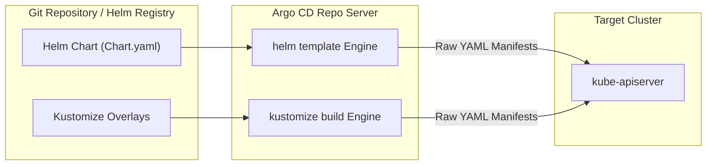
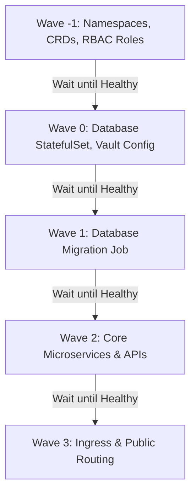

# Lesson 0015: Argo CD with Helm, Kustomize, sync waves, and hooks

## 1. Native Helm and Kustomize integration

Argo CD does not require developers to run Helm or Kustomize locally before committing. The `argocd-repo-server` detects chart files (`Chart.yaml`) or Kustomization overlays (`kustomization.yaml`) and compiles them into standard Kubernetes manifests dynamically.



---

## 2. Deploying Helm charts with Argo CD

You can deploy Helm charts directly from public or private Helm repositories, or from your own Git repository, by configuring `source.helm` in the `Application` CRD.

```yaml
apiVersion: argoproj.io/v1alpha1
kind: Application
metadata:
  name: redis-cache
  namespace: argocd
spec:
  project: default
  source:
    repoURL: 'https://charts.bitnami.com/bitnami'
    chart: redis
    targetRevision: 18.1.5
    helm:
      releaseName: redis-cache
      values: |
        architecture: standalone
        auth:
          enabled: true
          existingSecret: redis-secret
        master:
          persistence:
            size: 8Gi
  destination:
    server: 'https://kubernetes.default.svc'
    namespace: caching
  syncPolicy:
    automated:
      prune: true
      selfHeal: true
```

### Multiple values files from Git
If you store environment-specific value overrides in a Git repository alongside standard Helm charts:

```yaml
source:
  repoURL: 'https://github.com/my-org/gitops-config.git'
  targetRevision: main
  path: charts/ingress-nginx
  helm:
    valueFiles:
      - values.yaml
      - envs/production-values.yaml
```

---

## 3. Environment overlays with Kustomize

Kustomize defines a **`base`** set of manifests and applies environment-specific customizations (CPU and memory requests, replica counts, hostnames) without duplicating full YAML definitions.

### Directory layout
```
apps/microservice/
├── base/
│   ├── deployment.yaml
│   ├── service.yaml
│   └── kustomization.yaml
└── overlays/
    ├── dev/
    │   ├── kustomization.yaml
    │   └── replica_patch.yaml
    └── prod/
        ├── kustomization.yaml
        └── resource_patch.yaml
```

### Production Kustomization
```yaml
# overlays/prod/kustomization.yaml
apiVersion: kustomize.config.k8s.io/v1beta1
kind: Kustomization
bases:
  - ../../base
namePrefix: prod-
namespace: production
patchesStrategicMerge:
  - resource_patch.yaml
images:
  - name: my-org/microservice
    newTag: v2.4.1
```

---

## 4. Sync waves: Controlling deployment order

By default, Kubernetes and Argo CD apply all resources in a manifest simultaneously. Real deployments have dependencies (Namespaces and CRDs before operators, Databases before API services).

Argo CD uses **sync waves** to order resource application deterministically.

Resources are assigned a wave using the `argocd.argoproj.io/sync-wave` annotation. Waves execute in ascending numerical order, starting with negative integers.



```yaml
# Step 1: Create Namespace and CRDs first
apiVersion: v1
kind: Namespace
metadata:
  name: billing
  annotations:
    argocd.argoproj.io/sync-wave: "-1"
---
# Step 2: Deploy Database
apiVersion: apps/v1
kind: StatefulSet
metadata:
  name: billing-db
  namespace: billing
  annotations:
    argocd.argoproj.io/sync-wave: "0"
---
# Step 3: Deploy Application Pods
apiVersion: apps/v1
kind: Deployment
metadata:
  name: billing-api
  namespace: billing
  annotations:
    argocd.argoproj.io/sync-wave: "1"
```

!!! note "Wave progression rule"
    Argo CD will not begin applying resources in Wave `1` until all resources in Wave `0` reach a **Healthy** state.

---

## 5. Argo CD resource hooks

Resource hooks run scripts, database migrations, smoke tests, or notifications during specific phases of the synchronization cycle.

| Hook annotation | When it runs | Common use case |
| :--- | :--- | :--- |
| `PreSync` | Before any manifests in the sync wave are applied | Schema migration, backup DB snapshot |
| `Sync` | Synchronously alongside main manifests | Custom deployment scripts |
| `PostSync` | After all manifests have been applied and are healthy | Integration tests, smoke tests, Slack alerts |
| `SyncFail` | Triggered if any sync operation fails or errors | Rollback triggers, incident alerting |

### Example: Database migration PreSync hook Job
```yaml
apiVersion: batch/v1
kind: Job
metadata:
  name: db-migrate-schema
  namespace: billing
  annotations:
    argocd.argoproj.io/hook: PreSync
    argocd.argoproj.io/hook-delete-policy: BeforeHookCreation
spec:
  template:
    spec:
      containers:
      - name: migrate
        image: my-org/billing-schema:v1.2.0
        command: ["./migrate-db.sh"]
      restartPolicy: Never
  backoffLimit: 2
```

`argocd.argoproj.io/hook-delete-policy: BeforeHookCreation` deletes any previous instance of the migration job before creating the new one.

---

## Test your knowledge

1. When using Argo CD sync waves, which resources will be applied and verified healthy first?
   - [ ] A) Resources annotated with wave zero
   - [ ] B) Resources annotated with wave minus-one
   
   Answer: B. Lower numerical sync waves execute before higher ones, so negative integers run first.

2. Which hook annotation should you use to run automated smoke tests immediately after your application reaches a healthy status?
   - [ ] A) The PreSync hook annotation
   - [ ] B) The PostSync hook annotation
   
   Answer: B. PostSync hooks execute only after all manifests in the sync have been applied and reached a healthy state.

---

## Hands-on practice: Deploying with Kustomize and sync waves

### Step 1: Create a base directory with sync waves
Create `app-base.yaml`:
```yaml
apiVersion: v1
kind: ConfigMap
metadata:
  name: app-config
  annotations:
    argocd.argoproj.io/sync-wave: "1"
data:
  ENVIRONMENT: "production"
---
apiVersion: apps/v1
kind: Deployment
metadata:
  name: web-app
  annotations:
    argocd.argoproj.io/sync-wave: "2"
spec:
  replicas: 2
  selector:
    matchLabels:
      app: web-app
  template:
    metadata:
      labels:
        app: web-app
    spec:
      containers:
      - name: web
        image: nginx:1.25-alpine
        envFrom:
        - configMapRef:
            name: app-config
        ports:
        - containerPort: 80
```

### Step 2: Define an Application CRD
```yaml
apiVersion: argoproj.io/v1alpha1
kind: Application
metadata:
  name: ordered-deployment
  namespace: argocd
spec:
  project: default
  source:
    repoURL: 'https://github.com/argoproj/argocd-example-apps.git'
    targetRevision: HEAD
    path: pre-post-sync
  destination:
    server: 'https://kubernetes.default.svc'
    namespace: default
  syncPolicy:
    automated:
      prune: true
      selfHeal: true
```

---

## Recommended primary resources
- [Argo CD sync waves and hooks](https://argo-cd.readthedocs.io/en/stable/user-guide/sync-waves/)
- [Kubernetes Kustomize documentation](https://kubectl.docs.kubernetes.io/)

---

[← Lesson 14: GitOps principles and Argo CD fundamentals](./0014-gitops-principles-and-argocd-fundamentals.md) | [Lesson 16: Multi-cluster and multi-tenant management with ApplicationSets →](./0016-argo-applicationsets.md)
