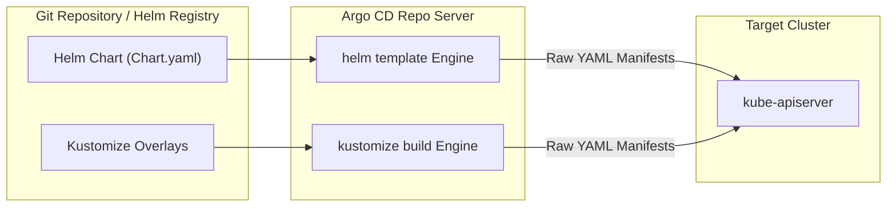
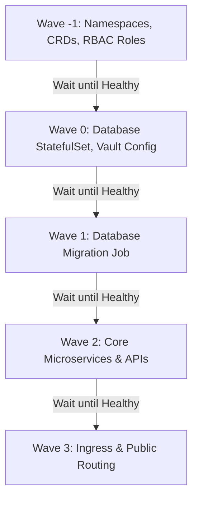

# Lesson 15: Argo CD with Helm, Kustomize, Sync Waves & Hooks

## 1. Native Helm & Kustomize Integration

Argo CD does not require developers to install the Helm or Kustomize CLI on their local machines. The `argocd-repo-server` natively detects chart formats (`Chart.yaml`) or Kustomization files (`kustomization.yaml`) and compiles them into pure Kubernetes manifests on the fly.



---

## 2. Deploying Helm Charts with Argo CD

You can deploy Helm charts directly from public/private Helm repositories or from your own Git repository by configuring the `source.helm` section in your `Application` CRD.

```yaml
apiVersion: argoproj.io/v1alpha1
kind: Application
metadata:
  name: redis-cache
  namespace: argocd
spec:
  project: default
  source:
    repoURL: 'https://charts.bitnami.com/bitnami'
    chart: redis
    targetRevision: 18.1.5
    helm:
      releaseName: redis-cache
      values: |
        architecture: standalone
        auth:
          enabled: true
          existingSecret: redis-secret
        master:
          persistence:
            size: 8Gi
  destination:
    server: 'https://kubernetes.default.svc'
    namespace: caching
  syncPolicy:
    automated:
      prune: true
      selfHeal: true
```

### Multiple Values Files from Git
If you store environment-specific value overrides in a Git repository alongside standard Helm charts:

```yaml
source:
  repoURL: 'https://github.com/my-org/gitops-config.git'
  targetRevision: main
  path: charts/ingress-nginx
  helm:
    valueFiles:
      - values.yaml
      - envs/production-values.yaml
```

---

## 3. Environment Overlays with Kustomize

Kustomize allows you to define a **`base`** set of manifests and overlay environment-specific customizations (e.g., CPU/memory requests, replicas, domain names) without duplicating YAML files.

### Typical Directory Layout:
```
apps/microservice/
├── base/
│   ├── deployment.yaml
│   ├── service.yaml
│   └── kustomization.yaml
└── overlays/
    ├── dev/
    │   ├── kustomization.yaml
    │   └── replica_patch.yaml
    └── prod/
        ├── kustomization.yaml
        └── resource_patch.yaml
```

### Production Kustomization (`overlays/prod/kustomization.yaml`):
```yaml
apiVersion: kustomize.config.k8s.io/v1beta1
kind: Kustomization
bases:
  - ../../base
namePrefix: prod-
namespace: production
patchesStrategicMerge:
  - resource_patch.yaml
images:
  - name: my-org/microservice
    newTag: v2.4.1
```

---

## 4. Sync Waves: Controlling Deployment Order

By default, Kubernetes and Argo CD apply all resources in a manifest simultaneously. However, real-world deployments have dependencies (e.g., Namespaces and CRDs must exist before Operators, Databases before App Services).

Argo CD uses **Sync Waves** to order resource application deterministically.

Resources are assigned a wave using the `argocd.argoproj.io/sync-wave` annotation. Waves are executed from the lowest numerical value to the highest (negative numbers are allowed).



```yaml
# Step 1: Create Namespace and CRDs first
apiVersion: v1
kind: Namespace
metadata:
  name: billing
  annotations:
    argocd.argoproj.io/sync-wave: "-1"
---
# Step 2: Deploy Database
apiVersion: apps/v1
kind: StatefulSet
metadata:
  name: billing-db
  namespace: billing
  annotations:
    argocd.argoproj.io/sync-wave: "0"
---
# Step 3: Deploy Application Pods
apiVersion: apps/v1
kind: Deployment
metadata:
  name: billing-api
  namespace: billing
  annotations:
    argocd.argoproj.io/sync-wave: "1"
```

!!! note "Wave Progression Rule"
    Argo CD will **not** begin applying resources in Wave `1` until all resources in Wave `0` have reached a **Healthy** state.

---

## 5. Argo CD Resource Hooks

Resource Hooks allow you to run scripts, schema migrations, smoke tests, or notifications during specific phases of a synchronization cycle.

| Hook Annotation | When It Runs | Common Use Case |
| :--- | :--- | :--- |
| `PreSync` | Before any manifests in the sync wave are applied | Schema migration, backup DB snapshot |
| `Sync` | Synchronously alongside main manifests | Custom deployment scripts |
| `PostSync` | After all manifests have been applied and are healthy | Integration tests, smoke tests, Slack alerts |
| `SyncFail` | Triggered if any sync operation fails or errors | Rollback triggers, incident alerting |

### Example: Database Migration PreSync Hook Job
```yaml
apiVersion: batch/v1
kind: Job
metadata:
  name: db-migrate-schema
  namespace: billing
  annotations:
    argocd.argoproj.io/hook: PreSync
    argocd.argoproj.io/hook-delete-policy: BeforeHookCreation
spec:
  template:
    spec:
      containers:
      - name: migrate
        image: my-org/billing-schema:v1.2.0
        command: ["./migrate-db.sh"]
      restartPolicy: Never
  backoffLimit: 2
```

`argocd.argoproj.io/hook-delete-policy: BeforeHookCreation` automatically deletes any previous migration job before running the new one.

---

## Test Your Knowledge

1. When using Argo CD sync waves, which resources will be applied and verified healthy first?
   - [ ] A) Resources annotated with wave zero
   - [ ] B) Resources annotated with wave minus-one
   
   *Answer:* B) Resources annotated with wave minus-one - Correct! Lower numerical sync waves execute before higher ones; negative integers run first.

2. Which hook annotation should you use to run automated smoke tests immediately after your application reaches a healthy status?
   - [ ] A) The PreSync hook annotation
   - [ ] B) The PostSync hook annotation
   
   *Answer:* B) The PostSync hook annotation - Correct! PostSync hooks run only after all manifests have been applied and have transitioned into a healthy state.

---

## Interactive Win: Deploying with Kustomize & Sync Waves

Let's configure a multi-stage application deployment using Kustomize overlays and Sync Waves.

### Step 1: Create a Base Directory with Sync Waves
Create `app-base.yaml`:
```yaml
apiVersion: v1
kind: ConfigMap
metadata:
  name: app-config
  annotations:
    argocd.argoproj.io/sync-wave: "1"
data:
  ENVIRONMENT: "production"
---
apiVersion: apps/v1
kind: Deployment
metadata:
  name: web-app
  annotations:
    argocd.argoproj.io/sync-wave: "2"
spec:
  replicas: 2
  selector:
    matchLabels:
      app: web-app
  template:
    metadata:
      labels:
        app: web-app
    spec:
      containers:
      - name: web
        image: nginx:1.25-alpine
        envFrom:
        - configMapRef:
            name: app-config
        ports:
        - containerPort: 80
```

### Step 2: Define an Application CRD
```yaml
apiVersion: argoproj.io/v1alpha1
kind: Application
metadata:
  name: ordered-deployment
  namespace: argocd
spec:
  project: default
  source:
    repoURL: 'https://github.com/argoproj/argocd-example-apps.git'
    targetRevision: HEAD
    path: pre-post-sync
  destination:
    server: 'https://kubernetes.default.svc'
    namespace: default
  syncPolicy:
    automated:
      prune: true
      selfHeal: true
```

---

## Recommended Primary Resource
- [Argo CD Sync Waves & Hooks Official Guide](https://argo-cd.readthedocs.io/en/stable/user-guide/sync-waves/)
- [Kubernetes Kustomize Documentation](https://kubectl.docs.kubernetes.io/)

---
**Need help structuring your Helm value files or writing custom hooks?** Ask in the chat, and we'll troubleshoot your sync order!

[← Lesson 14: GitOps Core Principles & Argo CD Fundamentals](./0014-gitops-principles-and-argocd-fundamentals.md) | [Lesson 16: Scaling Deployments with ApplicationSets →](./0016-argo-applicationsets.md)
