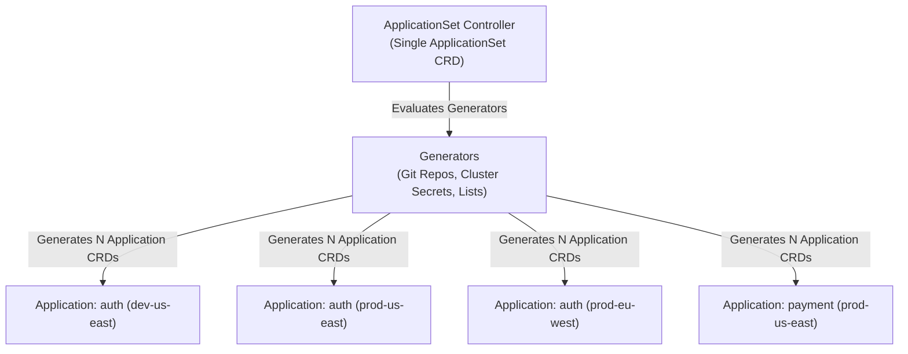
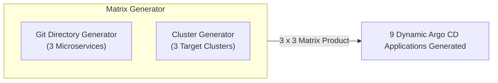

# Lesson 0016: Multi-cluster and multi-tenant management with ApplicationSets

## 1. Multi-cluster and multi-application challenges

In an enterprise environment with dozens of microservices running across multiple Kubernetes clusters (development, staging, production across multiple regions), writing individual `Application` CRDs for every permutation is unmaintainable.

**ApplicationSets** automate the generation of Argo CD `Application` resources using parameter generators.



---

## 2. Anatomy of an ApplicationSet

An `ApplicationSet` CRD consists of two main components:
1. **`generators`**: Define how to produce parameters (such as directory paths, cluster labels, or environment metadata).
2. **`template`**: An Argo CD `Application` manifest blueprint containing `{{ parameter }}` placeholders that are populated dynamically.

```yaml
apiVersion: argoproj.io/v1alpha1
kind: ApplicationSet
metadata:
  name: cluster-addons
  namespace: argocd
spec:
  generators:
    - list:
        elements:
          - env: development
            clusterName: dev-cluster
            server: https://10.0.0.1
          - env: staging
            clusterName: staging-cluster
            server: https://10.0.0.2
          - env: production
            clusterName: prod-cluster
            server: https://10.0.0.3
  template:
    metadata:
      name: '{{env}}-monitoring'
    spec:
      project: default
      source:
        repoURL: https://github.com/my-org/gitops-addons.git
        targetRevision: main
        path: 'addons/monitoring/{{env}}'
      destination:
        server: '{{server}}'
        namespace: monitoring
      syncPolicy:
        automated:
          prune: true
          selfHeal: true
```

---

## 3. Core generators

| Generator | Operation | Primary use case |
| :--- | :--- | :--- |
| **List Generator** | Uses a static list of key-value maps inside the manifest | Fixed environments or small cluster pools |
| **Cluster Generator** | Queries Argo CD cluster secrets using label selectors | Targeting all clusters labeled `env: prod` |
| **Git Directory Generator** | Scans directories in a Git repository matching a path pattern | Monorepo service layouts with one directory per service |
| **Git File Generator** | Reads JSON/YAML configuration files from a Git repository | Centralized cluster configuration registries |
| **Matrix Generator** | Computes the Cartesian product of two child generators | Deploying all applications in Git across all target clusters |
| **Merge Generator** | Combines two generators, using one to override defaults in the other | Default configuration with cluster-specific overrides |

---

## 4. The Matrix generator: Git folders across multiple clusters

The **Matrix Generator** deploys a collection of microservices across multiple target clusters simultaneously.



```yaml
apiVersion: argoproj.io/v1alpha1
kind: ApplicationSet
metadata:
  name: enterprise-workloads
  namespace: argocd
spec:
  generators:
    - matrix:
        generators:
          # Generator 1: Find all microservice directories
          - git:
              repoURL: https://github.com/my-org/services.git
              revision: main
              directories:
                - path: apps/*
          # Generator 2: Find all production clusters
          - clusters:
              selector:
                matchLabels:
                  tier: production
  template:
    metadata:
      name: '{{name}}-{{path.basename}}'
    spec:
      project: default
      source:
        repoURL: https://github.com/my-org/services.git
        targetRevision: main
        path: '{{path}}/overlays/{{metadata.labels.environment}}'
      destination:
        server: '{{server}}'
        namespace: '{{path.basename}}'
      syncPolicy:
        automated:
          prune: true
          selfHeal: true
```

---

## 5. Progressive syncs with ApplicationSets

When upgrading shared infrastructure services across clusters, **Progressive Syncs** enable controlled, staged rollouts instead of updating all clusters at once.

```yaml
apiVersion: argoproj.io/v1alpha1
kind: ApplicationSet
metadata:
  name: rolling-cluster-upgrade
  namespace: argocd
spec:
  strategy:
    type: RollingSync
    rollingSync:
      steps:
        - matchExpressions:
            - key: environment
              operator: In
              values:
                - dev
          maxUpdate: 100%
        - matchExpressions:
            - key: environment
              operator: In
              values:
                - staging
          maxUpdate: 100%
        - matchExpressions:
            - key: environment
              operator: In
              values:
                - prod
          maxUpdate: 25% # Upgrade production clusters gradually
  generators:
    - clusters: {}
  template:
    metadata:
      name: '{{name}}-ingress'
    spec:
      project: default
      source:
        repoURL: https://charts.bitnami.com/bitnami
        chart: nginx-ingress-controller
        targetRevision: 9.9.0
      destination:
        server: '{{server}}'
        namespace: ingress
```

---

## Test your knowledge

1. Which ApplicationSet generator computes the Cartesian product of two different generators?
   - [ ] A) The Matrix Generator
   - [ ] B) The Merge Generator
   
   Answer: A. The Matrix generator combines two child generators to produce applications matching all combinatorial pairs.

2. In an ApplicationSet Progressive Sync strategy, what prevents production clusters from updating if staging fails?
   - [ ] A) Subsequent steps pause until current steps succeed
   - [ ] B) Rollback triggers immediately upon cluster drain
   
   Answer: A. Progressive sync steps execute sequentially; a failure in an earlier stage blocks promotion to subsequent stages.

---

## Hands-on practice: Creating a directory-based ApplicationSet

### Step 1: Write the ApplicationSet manifest
Save this manifest as `appset-git-dirs.yaml`:
```yaml
apiVersion: argoproj.io/v1alpha1
kind: ApplicationSet
metadata:
  name: guestbook-services
  namespace: argocd
spec:
  generators:
    - git:
        repoURL: https://github.com/argoproj/argocd-example-apps.git
        revision: HEAD
        directories:
          - path: 'guestbook*'
  template:
    metadata:
      name: '{{path.basename}}'
    spec:
      project: default
      source:
        repoURL: https://github.com/argoproj/argocd-example-apps.git
        targetRevision: HEAD
        path: '{{path}}'
      destination:
        server: https://kubernetes.default.svc
        namespace: '{{path.basename}}'
      syncPolicy:
        automated:
          prune: true
          selfHeal: true
        syncOptions:
          - CreateNamespace=true
```

### Step 2: Apply the ApplicationSet
```bash
kubectl apply -f appset-git-dirs.yaml
```

### Step 3: Inspect generated applications
```bash
# View all generated Application resources
kubectl get applications -n argocd

# Inspect the ApplicationSet controller status
kubectl get applicationset guestbook-services -n argocd -o yaml
```

---

## Recommended primary resources
- [Argo CD ApplicationSet documentation](https://argo-cd.readthedocs.io/en/stable/user-guide/application-set/)
- [Progressive Syncs specification](https://argo-cd.readthedocs.io/en/stable/operator-manual/applicationset/Progressive-Syncs/)

---

[← Lesson 15: Argo CD with Helm, Kustomize, and sync waves](./0015-argo-helm-kustomize-sync-waves.md) | [Lesson 17: Secret management with Vault plugin and automated image updates →](./0017-argocd-image-updater-and-vault-plugin.md)
