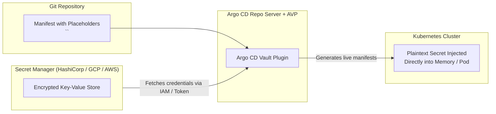
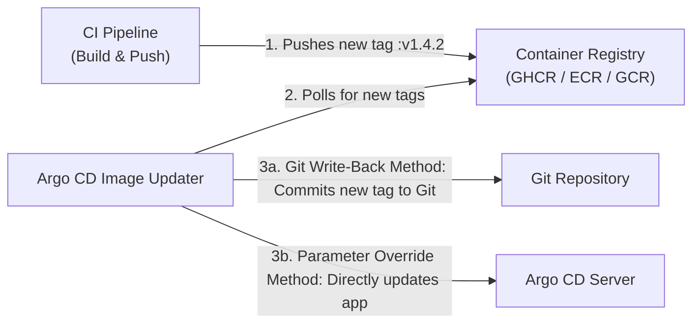

# Lesson 17: Secret Management (Argo CD Vault Plugin) & Automated Deployments (Argo CD Image Updater)

## 1. The GitOps Secrets Dilemma

In GitOps, all application configurations reside in Git. However, committing plaintext API keys, passwords, and TLS certificates directly to Git repositories is a severe security vulnerability.

Three industry-standard patterns exist for managing secrets in GitOps:

| Solution | Mechanism | Pros & Cons |
| :--- | :--- | :--- |
| **Sealed Secrets (Bitnami)** | Asymmetric encryption in Git; private key in cluster | Simple, but tied strictly to one cluster's private key |
| **External Secrets Operator (ESO)** | Syncs external secret stores into native K8s Secrets | Decoupled and native, but creates extra CRDs in cluster |
| **Argo CD Vault Plugin (AVP)** | Intercepts manifests in Argo CD repo-server and replaces placeholders | Zero secrets stored in Git; supports multiple cloud secret managers |



---

## 2. Argo CD Vault Plugin (AVP) Implementation

AVP is installed as a **ConfigManagementPlugin (CMP)** inside the `argocd-repo-server` container.

### A. Template with AVP Placeholders
In your Git repository, define your secret or ConfigMap using AVP path syntax:

```yaml
apiVersion: v1
kind: Secret
metadata:
  name: payment-credentials
  namespace: payments
  annotations:
    avp.kubernetes.io/path: "secret/data/payments/prod"
type: Opaque
stringData:
  DATABASE_PASSWORD: <password>
  STRIPE_API_KEY: <stripe_key>
  JWT_SECRET: <path:secret/data/auth#jwt_secret>
```

### B. AVP Plugin Configuration (`cmp-plugin.yaml`)
Configured in the Argo CD repo-server sidecar:

```yaml
apiVersion: v1
kind: ConfigMap
metadata:
  name: cmp-avp-plugin
  namespace: argocd
data:
  plugin.yaml: |
    apiVersion: config.argoproj.io/v1alpha1
    kind: ConfigManagementPlugin
    metadata:
      name: argocd-vault-plugin
    spec:
      version: v1.0
      generate:
        command: ["sh", "-c"]
        args: ["kustomize build . | argocd-vault-plugin generate -"]
```

---

## 3. Argo CD Image Updater

While Git should be the source of truth, manually creating Git commits every time a CI pipeline builds a new Docker container tag slows down continuous delivery.

**Argo CD Image Updater** is a standalone controller that monitors container image registries (Docker Hub, GHCR, ECR, GCR, Harbor) and updates Argo CD workloads automatically.



---

## 4. Image Updater Strategies & Write-Back Methods

### Update Strategies
- **`semver`**: Tracks semantic versioning constraints (e.g., `^1.2.0` or `~2.0.0`) and deploys the highest release tag.
- **`latest`**: Updates whenever a newer build timestamp or alphabetically higher tag appears.
- **`digest`**: Updates mutable tags (like `:latest` or `:master`) whenever their sha256 digest changes.

### Write-Back Methods
1. **`argocd` (Parameter Override):** Updates the running Argo CD application parameters in-memory. Fast, but causes Git drift.
2. **`git` (Direct Git Commit):** Image Updater clones the Git repository, updates the image tag in `.argocd-source-<app_name>.yaml`, commits, and pushes back to Git. Git remains 100% in sync.

### Production Manifest Annotation Example
Configure your `Application` CRD with Image Updater annotations:

```yaml
apiVersion: argoproj.io/v1alpha1
kind: Application
metadata:
  name: catalog-service
  namespace: argocd
  annotations:
    # 1. Specify which container images to track
    argocd-image-updater.argoproj.io/image-list: my-app=ghcr.io/my-org/catalog-service:~1.4
    
    # 2. Configure update strategy (Semantic Versioning)
    argocd-image-updater.argoproj.io/my-app.update-strategy: semver
    
    # 3. Specify Git write-back method
    argocd-image-updater.argoproj.io/write-back-method: git
    argocd-image-updater.argoproj.io/git-branch: main
    argocd-image-updater.argoproj.io/write-back-target: kustomization
spec:
  project: default
  source:
    repoURL: https://github.com/my-org/catalog-gitops.git
    targetRevision: main
    path: overlays/production
  destination:
    server: https://kubernetes.default.svc
    namespace: catalog
```

---

## Test Your Knowledge

1. Why is the Git write-back method preferred over parameter overrides for Argo CD Image Updater?
   - [ ] A) It retains Git as the single source of truth
   - [ ] B) It bypasses repository permissions to commit immediately
   
   *Answer:* A) It retains Git as the single source of truth - Correct! Git write-back ensures that any tag upgrades are committed back into version control, maintaining an accurate audit log.

2. When using Argo CD Vault Plugin, where are secrets decrypted into their plain text values?
   - [ ] A) Inside the Git repository prior to committing
   - [ ] B) Inside the repo server during manifest generation
   
   *Answer:* B) Inside the repo server during manifest generation - Correct! AVP replaces placeholders dynamically in memory when Argo CD renders manifests, never exposing raw values in Git.

---

## Interactive Win: Configuring Image Updater Annotations

Let's configure an Argo CD application to automatically update its image using SemVer constraints.

### Step 1: Create an Application with Image Tracking
Save as `app-image-updater.yaml`:
```yaml
apiVersion: argoproj.io/v1alpha1
kind: Application
metadata:
  name: auto-updated-nginx
  namespace: argocd
  annotations:
    argocd-image-updater.argoproj.io/image-list: web=nginx:~1.25.0
    argocd-image-updater.argoproj.io/web.update-strategy: semver
    argocd-image-updater.argoproj.io/write-back-method: argocd
spec:
  project: default
  source:
    repoURL: https://github.com/argoproj/argocd-example-apps.git
    targetRevision: HEAD
    path: guestbook
  destination:
    server: https://kubernetes.default.svc
    namespace: default
  syncPolicy:
    automated:
      prune: true
      selfHeal: true
```

### Step 2: Install Image Updater & Verify Logs
```bash
# Install Argo CD Image Updater controller
kubectl apply -n argocd -f https://raw.githubusercontent.com/argoproj-labs/argocd-image-updater/stable/manifests/install.yaml

# Monitor Image Updater logs as it inspects container registries
kubectl logs -n argocd -l app.kubernetes.io/name=argocd-image-updater -f
```

---

## Recommended Primary Resource
- [Argo CD Vault Plugin Documentation](https://argocd-vault-plugin.readthedocs.io/)
- [Argo CD Image Updater Official Guide](https://argocd-image-updater.readthedocs.io/)

---
**Setting up HashiCorp Vault Kubernetes Auth or AWS IRSA?** Let us know in chat, and we can configure your provider tokens!

[← Lesson 16: Multi-Cluster Scalability with ApplicationSets](./0016-argo-applicationsets.md) | [Lesson 18: Production GitOps with Argo CD Autopilot →](./0018-argocd-autopilot-repo-structure.md)
