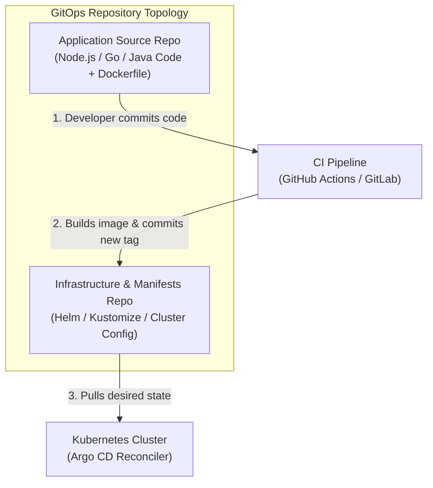
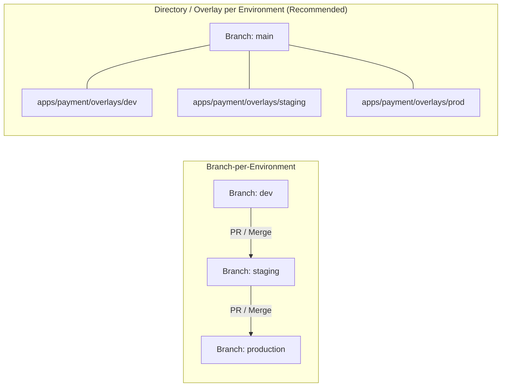

# Lesson 0018: Production repository architecture and Argo CD Autopilot

## 1. Production GitOps repository topologies

Structuring Git repositories effectively supports access control (RBAC), auditing, and disaster recovery.



### Why separate application code from GitOps manifests?
1. **Clean commit history:** Automated tag updates happen continuously; separating repositories keeps these automated commits out of application code history.
2. **Access control (RBAC):** Developers have write access to application repositories, while platform teams control approvals on production cluster manifests.
3. **Disaster recovery:** If a cluster is destroyed, point a freshly provisioned cluster to the configuration repository to restore all workloads quickly.

---

## 2. What is Argo CD Autopilot?

**Argo CD Autopilot** is an opinionated tool from the Argo project that implements standardized GitOps directory layouts, multi-project isolation, and cluster bootstrapping.

Autopilot establishes a consistent structure across teams:

```
gitops-repo/
├── bootstrap/                    # Argo CD installation and root controllers
│   ├── cluster-resources/
│   └── root.yaml
├── projects/                     # Argo CD AppProjects (team and security boundaries)
│   ├── core-platform/
│   ├── payments-team/
│   └── analytics-team/
└── apps/                         # Workloads and multi-environment overlays
    ├── ingress-nginx/
    └── payment-api/
        ├── base/
        └── overlays/
            ├── staging/
            └── production/
```

---

## 3. Autopilot CLI workflow

### A. Bootstrapping a new cluster
```bash
# Export Git provider credentials
export GIT_TOKEN=ghp_yourpersonalaccesstoken
export GIT_REPO=https://github.com/my-org/production-gitops

# Bootstrap Argo CD into your Kubernetes cluster
argocd-autopilot repo bootstrap
```
This installs Argo CD, commits the installation manifests into `bootstrap/` in your repository, and deploys the root bootstrap application.

### B. Creating a team project
```bash
argocd-autopilot project create payments-team
```
This generates an `AppProject` CRD with destination cluster and namespace constraints.

### C. Onboarding an application
```bash
argocd-autopilot app create payment-api \
  --app github.com/my-org/payment-api/manifests \
  --project payments-team
```

---

## 4. Multi-environment promotion patterns

Promoting releases across environments (Development $\to$ Staging $\to$ Production) in GitOps follows two common strategies:



| Promotion strategy | Advantages | Trade-offs |
| :--- | :--- | :--- |
| **Directory / Overlay (Recommended)** | Single branch (`main`); changes are visible side-by-side in PR diffs | Requires Kustomize or Helm value overlays |
| **Branch-per-Environment** | Strict Git branch protection rules per environment | High merge conflict risk; branches diverge over time |

---

## Test your knowledge

1. Why should you separate application source code repositories from GitOps manifest repositories?
   - [ ] A) To maintain separated access controls and clear histories
   - [ ] B) To avoid running container image builds on clusters
   
   Answer: A. Separating repositories isolates CI automation updates from source code and enables fine-grained RBAC for cluster configuration.

2. In the Argo CD Autopilot directory layout, what is stored inside the `projects/` directory?
   - [ ] A) AppProject custom resources defining security boundaries
   - [ ] B) Container images pushed from external build pipelines
   
   Answer: A. The `projects/` directory holds AppProject CRDs that govern namespace access, cluster destinations, and source repository whitelists.

---

## Hands-on practice: Creating an isolated AppProject

### Step 1: Create an isolated AppProject manifest
Save as `team-project.yaml`:
```yaml
apiVersion: argoproj.io/v1alpha1
kind: AppProject
metadata:
  name: billing-team
  namespace: argocd
  finalizers:
    - resources-finalizer.argocd.argoproj.io
spec:
  description: "Billing microservices managed by billing engineering"
  # Restrict which source Git repos this team can deploy from
  sourceRepos:
    - 'https://github.com/my-org/billing-*'
  # Restrict which cluster and namespace they can deploy into
  destinations:
    - namespace: 'billing-*'
      server: 'https://kubernetes.default.svc'
  # Restrict which cluster-scoped resources they can create
  clusterResourceWhitelist:
    - group: ''
      kind: Namespace
```

### Step 2: Apply the AppProject
```bash
kubectl apply -f team-project.yaml
```

---

## Recommended primary resources
- [Argo CD Autopilot documentation](https://argocd-autopilot.readthedocs.io/)
- [OpenGitOps repository best practices](https://opengitops.dev/)

---

[← Lesson 17: Secret management with Vault plugin and automated image updates](./0017-argocd-image-updater-and-vault-plugin.md) | [Lesson 19: Progressive delivery with Argo Rollouts →](./0019-argo-rollouts-progressive-delivery.md)
