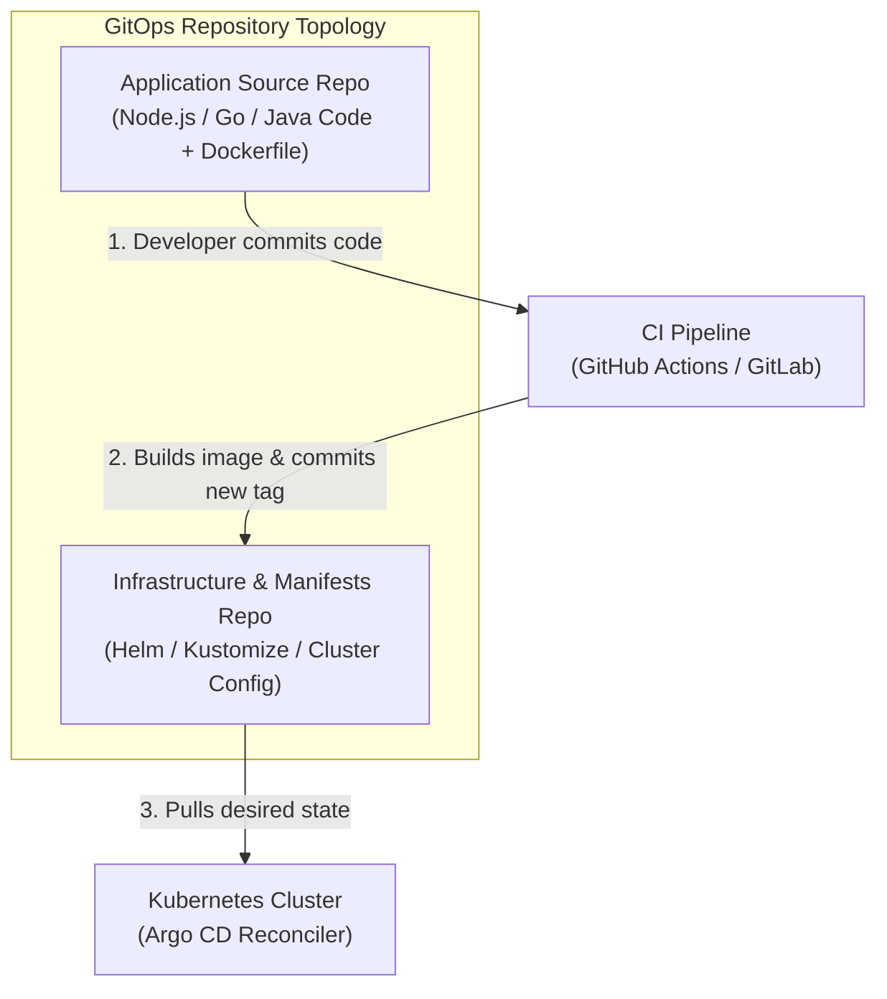
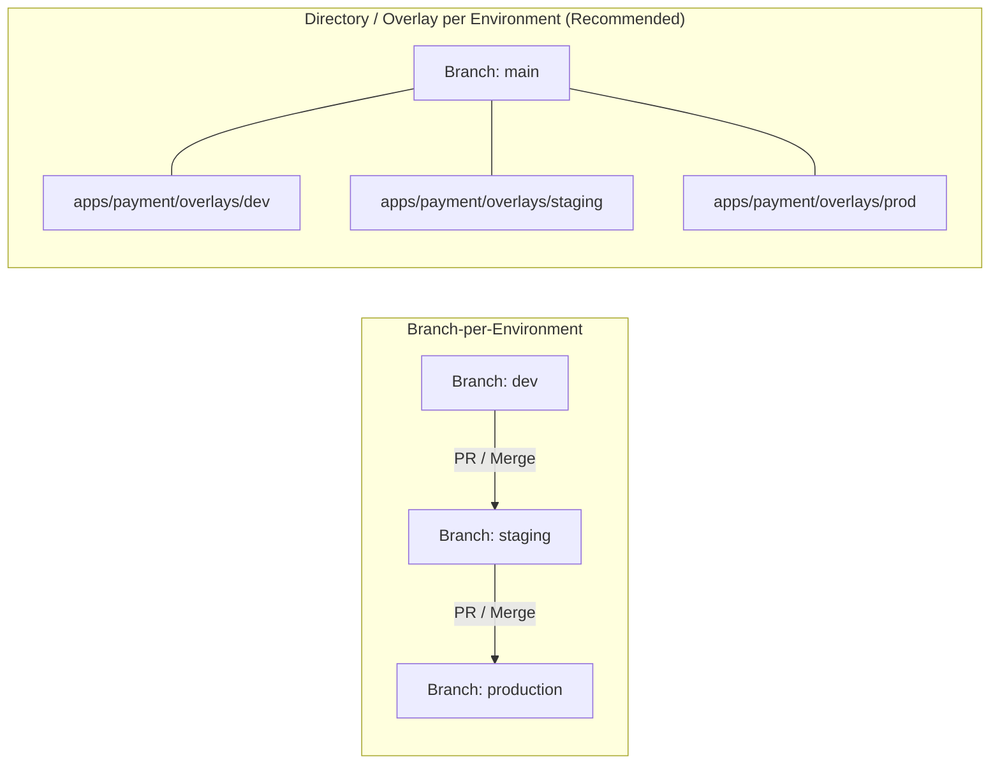

# Lesson 18: Production GitOps Architecture & Bootstrapping with Argo CD Autopilot

## 1. Production GitOps Repository Topologies

When adopting GitOps at scale, structuring your Git repositories correctly is critical for team velocity, access control (RBAC), and disaster recovery.



### Why Separate Application Code from GitOps Manifests?
1. **Clean Commit History:** Continuous deployments update image tags dozens of times a day; keeping this in an infra repo prevents polluting application code history.
2. **Access Control (RBAC):** Developers can have write access to application code while only platform/DevOps engineers can merge PRs to production cluster infrastructure.
3. **Disaster Recovery:** If an entire cloud region or cluster is destroyed, point a newly provisioned cluster to the Config Repo to restore all workloads within minutes.

---

## 2. What is Argo CD Autopilot?

**Argo CD Autopilot** is an opinionated tool developed by the Argo team that implements best-practice GitOps directory structures, multi-project isolation, and automated cluster bootstrapping.

Instead of writing custom directory structures and initial root application manifests from scratch, Autopilot configures everything using a clean, standardized hierarchy.

```
gitops-repo/
├── bootstrap/                    # Argo CD installation & root controllers
│   ├── cluster-resources/
│   └── root.yaml
├── projects/                     # Argo CD AppProjects (team / security boundaries)
│   ├── core-platform/
│   ├── payments-team/
│   └── analytics-team/
└── apps/                         # Workloads and multi-environment overlays
    ├── ingress-nginx/
    └── payment-api/
        ├── base/
        └── overlays/
            ├── staging/
            └── production/
```

---

## 3. Autopilot CLI Workflow

The Autopilot CLI simplifies repository bootstrapping and application onboarding into a few standard commands.

### A. Bootstrapping a New Cluster
```bash
# Export your Git provider credentials
export GIT_TOKEN=ghp_yourpersonalaccesstoken
export GIT_REPO=https://github.com/my-org/production-gitops

# Bootstrap Argo CD into your Kubernetes cluster
argocd-autopilot repo bootstrap
```
*What this does:* Installs Argo CD, commits the installation YAMLs into the `bootstrap/` folder of your Git repo, and applies the root bootstrap application.

### B. Creating a Team Project
```bash
argocd-autopilot project create payments-team
```
*What this does:* Commits an `AppProject` CRD defining allowed namespaces, destination clusters, and repository whitelists.

### C. Onboarding an Application
```bash
argocd-autopilot app create payment-api \
  --app github.com/my-org/payment-api/manifests \
  --project payments-team
```

---

## 4. Multi-Environment Promotion Patterns

Promoting releases across environments (Development → Staging → Production) in GitOps follows two primary strategies:



| Promotion Strategy | Advantages | Trade-offs |
| :--- | :--- | :--- |
| **Directory / Overlay (Recommended)** | Single branch (`main`); changes are visible side-by-side in PR diffs | Requires Kustomize or Helm value overlays |
| **Branch-per-Environment** | Strict Git branch protection rules per environment | High merge conflict risk; branches diverge over time |

---

## Test Your Knowledge

1. Why should you separate application source code repositories from GitOps manifest repositories?
   - [ ] A) To maintain separated access controls and clear histories
   - [ ] B) To avoid running container image builds on clusters
   
   *Answer:* A) To maintain separated access controls and clear histories - Correct! Separating repositories isolates CI automation noise from core source code and enables fine-grained RBAC for cluster configuration.

2. In the Argo CD Autopilot directory layout, what is stored inside the `projects/` directory?
   - [ ] A) AppProject custom resources defining security boundaries
   - [ ] B) Container images pushed from external build pipelines
   
   *Answer:* A) AppProject custom resources defining security boundaries - Correct! The `projects/` directory holds AppProject CRDs which govern namespace access, cluster destinations, and source repository whitelists.

---

## Interactive Win: Designing a Production GitOps Structure

Let's inspect how an `AppProject` CRD isolates a development team from modifying production namespaces.

### Step 1: Create an Isolated AppProject Manifest
Save as `team-project.yaml`:
```yaml
apiVersion: argoproj.io/v1alpha1
kind: AppProject
metadata:
  name: billing-team
  namespace: argocd
  finalizers:
    - resources-finalizer.argocd.argoproj.io
spec:
  description: "Billing microservices managed by billing engineering"
  # Restrict which source Git repos this team can deploy from
  sourceRepos:
    - 'https://github.com/my-org/billing-*'
  # Restrict which cluster and namespace they can deploy into
  destinations:
    - namespace: 'billing-*'
      server: 'https://kubernetes.default.svc'
  # Restrict which cluster-scoped resources they can create
  clusterResourceWhitelist:
    - group: ''
      kind: Namespace
```

### Step 2: Apply the AppProject
```bash
kubectl apply -f team-project.yaml
```

---

## Recommended Primary Resource
- [Argo CD Autopilot Official Documentation](https://argocd-autopilot.readthedocs.io/)
- [OpenGitOps Directory & Repository Best Practices](https://opengitops.dev/)

---
**Setting up multi-tenant project policies or promotion workflows?** Let us know in chat, and we'll configure your AppProject RBAC rules!

[← Lesson 17: Secret Management & Image Updater](./0017-argocd-image-updater-and-vault-plugin.md) | [Lesson 19: Progressive Delivery with Argo Rollouts →](./0019-argo-rollouts-progressive-delivery.md)
