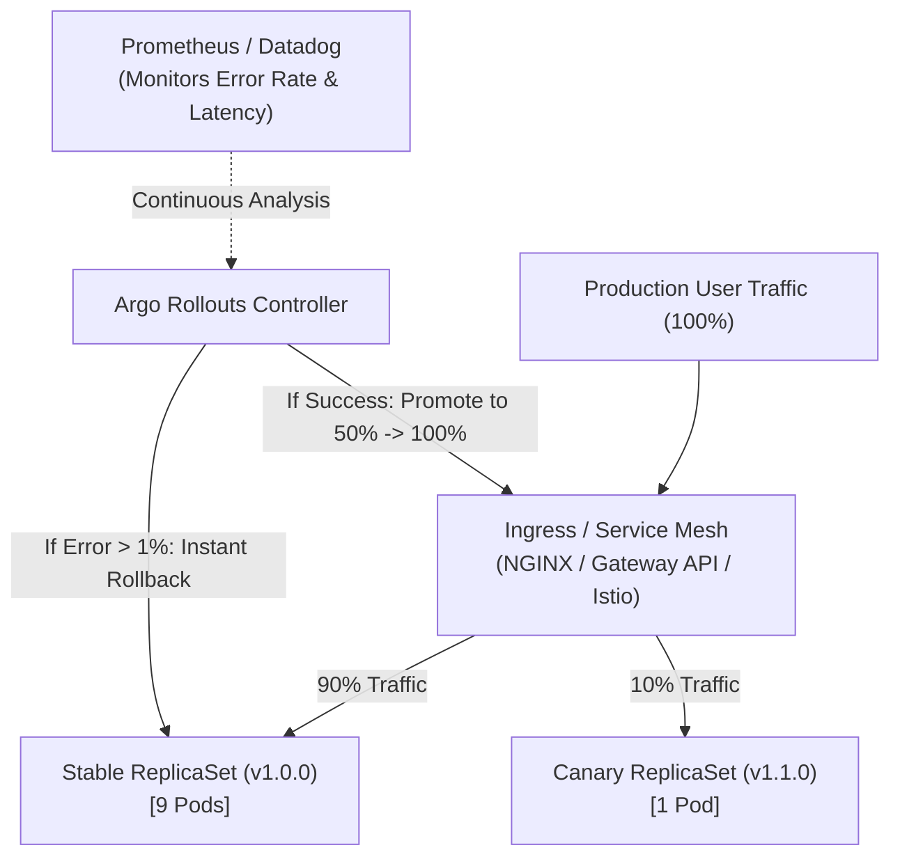
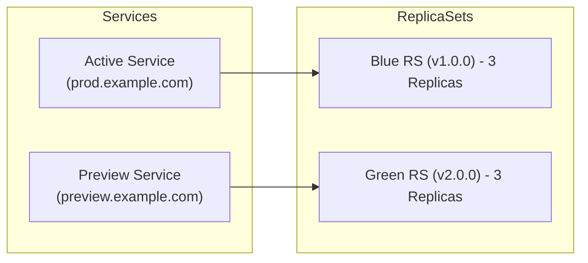

# Lesson 0019: Progressive delivery with Argo Rollouts

## 1. Why standard Kubernetes Deployments fall short

Standard Kubernetes `Deployment` resources support rolling updates, but have several operational limits:

- **No fine-grained traffic splitting:** You cannot route a small fraction (such as 5%) of production traffic to a new version without scaling pod counts proportionally.
- **No metric-driven progression:** Kubernetes relies on basic container probes; it cannot query Prometheus to verify error rates or latency percentiles before advancing a rollout.
- **No automated metric-driven rollbacks:** If an application regression occurs, human intervention is needed to run `kubectl rollout undo`.

**Argo Rollouts** adds **progressive delivery** capabilities to Kubernetes by introducing the **`Rollout`** CRD.



---

## 2. Deployment strategies: Blue/Green versus Canary

### A. Blue/Green deployment
Spins up the new version (Green) alongside the active version (Blue). An active Service directs traffic to Blue while a preview Service directs traffic to Green for validation. Once verified, traffic switches to Green.



### B. Canary deployment with traffic routing
Gradually shifts traffic in discrete increments (such as 10% $\to$ 25% $\to$ 50% $\to$ 100%) using an ingress controller or service mesh (Ingress NGINX, Gateway API, Istio, Envoy).

---

## 3. Defining a canary rollout

Below is a declarative `Rollout` manifest using step-based canary progression:

```yaml
apiVersion: argoproj.io/v1alpha1
kind: Rollout
metadata:
  name: order-service
  namespace: default
spec:
  replicas: 5
  strategy:
    canary:
      # Reference to analysis template for automatic verification
      analysis:
        templates:
          - templateName: success-rate-check
        args:
          - name: service-name
            value: order-service
      # Progressive steps
      steps:
        - setWeight: 10
        - pause: { duration: 5m } # Wait 5 minutes and analyze metrics
        - setWeight: 30
        - pause: { duration: 10m }
        - setWeight: 60
        - pause: { duration: 10m }
  selector:
    matchLabels:
      app: order-service
  template:
    metadata:
      labels:
        app: order-service
    spec:
      containers:
      - name: order-api
        image: my-org/order-service:v2.0.0
        ports:
        - containerPort: 8080
```

---

## 4. Automated metric analysis with AnalysisTemplate

An **`AnalysisTemplate`** queries monitoring systems (Prometheus, Datadog, CloudWatch, New Relic) and aborts the rollout automatically if error thresholds are exceeded.

```yaml
apiVersion: argoproj.io/v1alpha1
kind: AnalysisTemplate
metadata:
  name: success-rate-check
  namespace: default
spec:
  args:
    - name: service-name
  metrics:
    - name: success-rate
      interval: 1m
      successCondition: result[0] >= 0.99 # Requires >= 99% HTTP 2xx/3xx rate
      failureLimit: 2                    # Abort if 2 consecutive failures occur
      provider:
        prometheus:
          address: http://prometheus-k8s.monitoring:9090
          query: |
            sum(rate(http_requests_total{app="{{args.service-name}}",status=~"2.*|3.*"}[2m]))
            /
            sum(rate(http_requests_total{app="{{args.service-name}}"}[2m]))
```

!!! important "Instant automated rollbacks"
    If the Prometheus query returns a success rate below 99% during any canary phase, Argo Rollouts scales the canary ReplicaSet to 0 and directs all traffic back to the stable ReplicaSet.

---

## 5. Rollouts CLI and dashboard management

```bash
# Watch the visual progression of a rollout
kubectl argo rollouts get rollout order-service --watch

# Promote a paused rollout manually
kubectl argo rollouts promote order-service

# Abort and rollback
kubectl argo rollouts abort order-service

# Launch the local web dashboard
kubectl argo rollouts dashboard
```

---

## Test your knowledge

1. What occurs if an `AnalysisTemplate` query exceeds its configured failure limit during a canary step?
   - [ ] A) The rollout aborts and restores stable traffic
   - [ ] B) The rollout pauses and waits for confirmation
   
   Answer: A. When metric thresholds breach failure limits, Argo Rollouts terminates the canary and restores 100% of traffic to the stable revision.

2. In a Blue/Green rollout strategy, what is the role of the preview service?
   - [ ] A) Directing production traffic toward the active release
   - [ ] B) Providing testing access toward the candidate release
   
   Answer: B. The preview service routes internal or QA traffic to the new Green ReplicaSet before it is promoted to serve live production traffic.

---

## Hands-on practice: Deploying a canary rollout and CLI inspection

### Step 1: Install Argo Rollouts
```bash
# Create dedicated namespace & install controller
kubectl create namespace argo-rollouts
kubectl apply -n argo-rollouts -f https://github.com/argoproj/argo-rollouts/releases/latest/download/install.yaml

# Check controller status
kubectl get pods -n argo-rollouts
```

### Step 2: Deploy a sample canary rollout
Save as `sample-rollout.yaml`:
```yaml
apiVersion: argoproj.io/v1alpha1
kind: Rollout
metadata:
  name: rollouts-demo
  namespace: default
spec:
  replicas: 4
  strategy:
    canary:
      steps:
      - setWeight: 25
      - pause: { duration: 30s }
      - setWeight: 50
      - pause: { duration: 30s }
  selector:
    matchLabels:
      app: rollouts-demo
  template:
    metadata:
      labels:
        app: rollouts-demo
    spec:
      containers:
      - name: rollouts-demo
        image: argoproj/rollouts-demo:blue
        ports:
        - containerPort: 8080
```

Apply the rollout:
```bash
kubectl apply -f sample-rollout.yaml
```

### Step 3: Trigger a release and observe
```bash
# Update the image to trigger a canary release
kubectl argo rollouts set image rollouts-demo rollouts-demo=argoproj/rollouts-demo:yellow

# Watch step-by-step traffic weight allocation
kubectl argo rollouts get rollout rollouts-demo --watch
```

---

## Recommended primary resources
- [Argo Rollouts documentation](https://argoproj.github.io/argo-rollouts/)
- [Automated analysis with Prometheus](https://argoproj.github.io/argo-rollouts/features/analysis/)

---

[← Lesson 18: Production repository architecture and Argo CD Autopilot](./0018-argocd-autopilot-repo-structure.md) | [Lesson 20: Pipelines and event-driven automation with Argo Workflows and Argo Events →](./0020-argo-workflows-and-argo-events.md)
