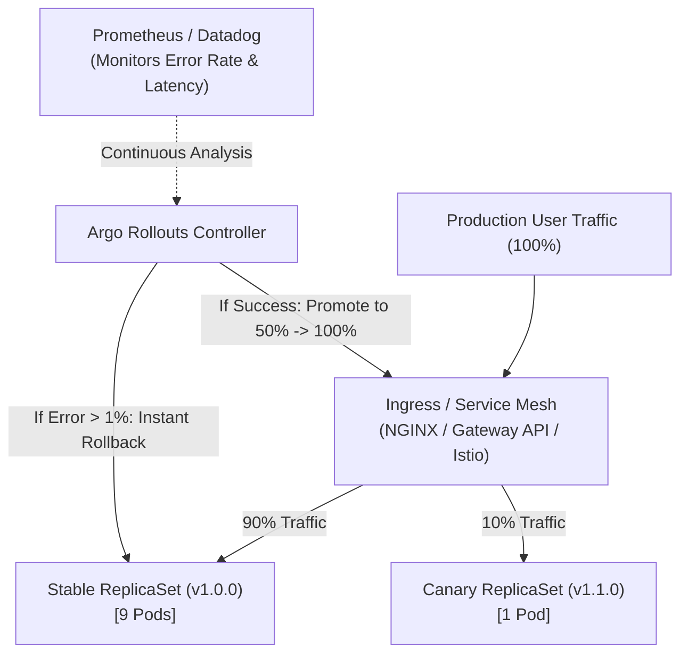
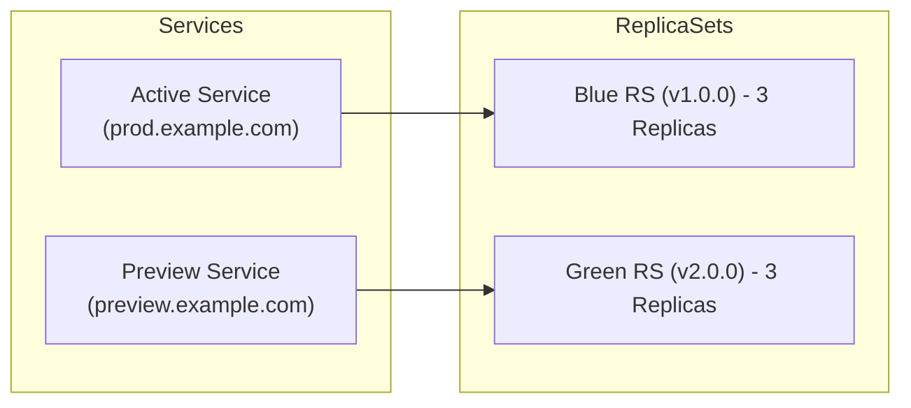

# Lesson 19: Progressive Delivery with Argo Rollouts (Canary, Blue/Green & Metrics Analysis)

## 1. Why Standard Kubernetes Deployments Fall Short

Standard Kubernetes `Deployment` resources support `RollingUpdate`. However, RollingUpdates come with critical operational limitations:

- **No Traffic Splitting:** You cannot route a small percentage (e.g., 5%) of production traffic to the new version unless you scale pod counts proportionally.
- **No Metric-Driven Decision Making:** Kubernetes checks basic readiness probes; it cannot query Prometheus to see if HTTP 500 errors spiked or latency degraded before proceeding.
- **No Automated Metric Rollback:** If a regression occurs, human intervention is required to run `kubectl rollout undo`.

**Argo Rollouts** brings **Progressive Delivery** to Kubernetes by replacing the `Deployment` resource with a feature-complete **`Rollout`** CRD.



---

## 2. Deployment Strategies: Blue/Green vs. Canary

Argo Rollouts supports two primary advanced deployment strategies:

### A. Blue/Green Deployment
Spins up a new version (Green) alongside the current version (Blue). An active Service points to Blue while a preview Service points to Green for smoke testing. Once verified, traffic switches instantaneously to Green.



### B. Canary Deployment with Traffic Routing
Gradually shifts traffic in discrete steps (e.g., 10% → 25% → 50% → 100%) using an ingress controller or service mesh (Ingress NGINX, GKE Gateway API, Istio, Linkerd, ALB).

---

## 3. Defining a Canary Rollout

Here is a declarative `Rollout` manifest using step-based canary progression:

```yaml
apiVersion: argoproj.io/v1alpha1
kind: Rollout
metadata:
  name: order-service
  namespace: default
spec:
  replicas: 5
  strategy:
    canary:
      # Reference to analysis template for automatic verification
      analysis:
        templates:
          - templateName: success-rate-check
        args:
          - name: service-name
            value: order-service
      # Progressive steps
      steps:
        - setWeight: 10
        - pause: { duration: 5m } # Wait 5 minutes and analyze metrics
        - setWeight: 30
        - pause: { duration: 10m }
        - setWeight: 60
        - pause: { duration: 10m }
  selector:
    matchLabels:
      app: order-service
  template:
    metadata:
      labels:
        app: order-service
    spec:
      containers:
      - name: order-api
        image: my-org/order-service:v2.0.0
        ports:
        - containerPort: 8080
```

---

## 4. Automated Metric Analysis with `AnalysisTemplate`

An **`AnalysisTemplate`** queries your monitoring systems (Prometheus, Datadog, CloudWatch, New Relic, Webhooks) and aborts the rollout automatically if thresholds are exceeded.

```yaml
apiVersion: argoproj.io/v1alpha1
kind: AnalysisTemplate
metadata:
  name: success-rate-check
  namespace: default
spec:
  args:
    - name: service-name
  metrics:
    - name: success-rate
      interval: 1m
      successCondition: result[0] >= 0.99 # Requires >= 99% HTTP 2xx/3xx rate
      failureLimit: 2                    # Abort if 2 consecutive failures occur
      provider:
        prometheus:
          address: http://prometheus-k8s.monitoring:9090
          query: |
            sum(rate(http_requests_total{app="{{args.service-name}}",status=~"2.*|3.*"}[2m]))
            /
            sum(rate(http_requests_total{app="{{args.service-name}}"}[2m]))
```

!!! important "Zero-Downtime Instant Rollback"
    If the Prometheus query returns a success rate below 99% during any canary phase, Argo Rollouts **instantly scales the canary ReplicaSet to 0** and points 100% of traffic back to the stable ReplicaSet without human intervention.

---

## 5. Rollouts CLI & Dashboard Management

Platform engineers interact with rollouts using the `kubectl-argo-rollouts` plugin:

```bash
# Watch the live visual progression of a rollout
kubectl argo rollouts get rollout order-service --watch

# Promote a paused rollout manually
kubectl argo rollouts promote order-service

# Abort and instantly rollback
kubectl argo rollouts abort order-service

# Launch the interactive local Web Dashboard
kubectl argo rollouts dashboard
```

---

## Test Your Knowledge

1. What occurs if an `AnalysisTemplate` query exceeds its configured failure limit during a canary step?
   - [ ] A) The rollout aborts and restores stable traffic
   - [ ] B) The rollout pauses and waits for confirmation
   
   *Answer:* A) The rollout aborts and restores stable traffic - Correct! When metric thresholds breach failure limits, Argo Rollouts terminates the canary and restores 100% of traffic to the stable revision.

2. In a Blue/Green rollout strategy, what is the role of the preview service?
   - [ ] A) Directing production traffic toward the active release
   - [ ] B) Providing testing access toward the candidate release
   
   *Answer:* B) Providing testing access toward the candidate release - Correct! The preview service routes internal or QA traffic to the new Green ReplicaSet before it is promoted to serve live production traffic.

---

## Interactive Win: Deploying a Canary Rollout & CLI Inspection

Let's deploy the Argo Rollouts controller and run a live canary rollout.

### Step 1: Install Argo Rollouts
```bash
# Create dedicated namespace & install controller
kubectl create namespace argo-rollouts
kubectl apply -n argo-rollouts -f https://github.com/argoproj/argo-rollouts/releases/latest/download/install.yaml

# Check controller status
kubectl get pods -n argo-rollouts
```

### Step 2: Deploy a Sample Canary Rollout
Save as `sample-rollout.yaml`:
```yaml
apiVersion: argoproj.io/v1alpha1
kind: Rollout
metadata:
  name: rollouts-demo
  namespace: default
spec:
  replicas: 4
  strategy:
    canary:
      steps:
      - setWeight: 25
      - pause: { duration: 30s }
      - setWeight: 50
      - pause: { duration: 30s }
  selector:
    matchLabels:
      app: rollouts-demo
  template:
    metadata:
      labels:
        app: rollouts-demo
    spec:
      containers:
      - name: rollouts-demo
        image: argoproj/rollouts-demo:blue
        ports:
        - containerPort: 8080
```

Apply the rollout:
```bash
kubectl apply -f sample-rollout.yaml
```

### Step 3: Trigger a Release & Observe
```bash
# Update the image to trigger a canary release
kubectl argo rollouts set image rollouts-demo rollouts-demo=argoproj/rollouts-demo:yellow

# Watch step-by-step traffic weight allocation
kubectl argo rollouts get rollout rollouts-demo --watch
```

---

## Recommended Primary Resource
- [Argo Rollouts Official Architecture & Quickstart](https://argoproj.github.io/argo-rollouts/)
- [Automated Analysis with Prometheus](https://argoproj.github.io/argo-rollouts/features/analysis/)

---
**Setting up Service Mesh traffic routing (Istio VirtualService or NGINX ingress canary annotations)?** Ask in chat, and we'll configure your routing rules!

[← Lesson 18: Production GitOps with Argo CD Autopilot](./0018-argocd-autopilot-repo-structure.md) | [Lesson 20: Pipelines with Argo Workflows & Argo Events →](./0020-argo-workflows-and-argo-events.md)
