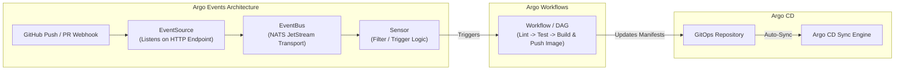
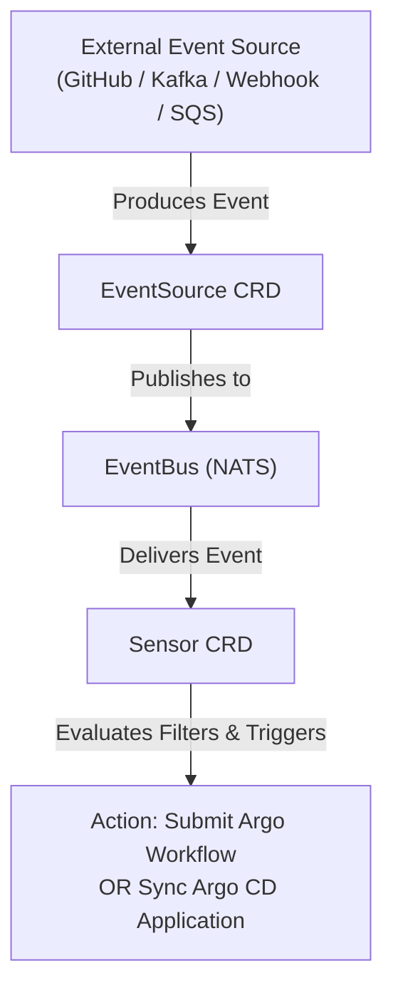

# Lesson 20: Event-Driven Automation & Pipelines with Argo Workflows & Argo Events

## 1. The Argo Kubernetes-Native CI/CD Stack

While Argo CD handles **Continuous Delivery (CD)** and GitOps reconciliation, modern cloud-native engineering requires two additional capabilities:
1. **Container Workflow Execution (CI / Pipelines):** Building code, executing integration tests, and running ML/data processing.
2. **Event-Driven Automation:** Reacting to external webhooks, Kafka streams, cloud pub/sub messages, or storage bucket uploads in real time.

The Argo project provides two purpose-built tools for this: **Argo Workflows** and **Argo Events**.



---

## 2. Argo Workflows: Kubernetes-Native DAGs & CI

**Argo Workflows** runs each step of your pipeline inside its own isolated Kubernetes Pod. It provides native support for **Directed Acyclic Graphs (DAGs)**, artifact sharing (via S3/GCS/MinIO), and retries.

### Core Custom Resources:
- **`Workflow`**: A single instance of an executing pipeline.
- **`WorkflowTemplate`**: A reusable, parameterized pipeline definition stored in a namespace.
- **`CronWorkflow`**: Scheduled workflows (e.g., nightly builds, database backups).

### Example: A Complete CI Pipeline with DAGs
```yaml
apiVersion: argoproj.io/v1alpha1
kind: Workflow
metadata:
  generateName: ci-pipeline-
  namespace: argo
spec:
  entrypoint: build-and-test-dag
  templates:
  - name: build-and-test-dag
    dag:
      tasks:
      - name: lint-code
        template: run-linter
      - name: unit-tests
        template: run-tests
      - name: build-docker-image
        dependencies: [lint-code, unit-tests]
        template: kaniko-build

  - name: run-linter
    container:
      image: golangci/golangci-lint:v1.54
      command: [golangci-lint]
      args: ["run"]

  - name: run-tests
    container:
      image: golang:1.21
      command: [go]
      args: ["test", "-v", "./..."]

  - name: kaniko-build
    container:
      image: gcr.io/kaniko-project/executor:latest
      args:
        - "--context=git://github.com/my-org/auth-service.git"
        - "--destination=ghcr.io/my-org/auth-service:latest"
```

---

## 3. Argo Events: Event-Driven Framework

**Argo Events** transforms external signals into Kubernetes actions. Its architecture is built on three decoupled components:



1. **`EventSource`**: Configures listeners for external event producers (e.g., GitHub webhooks, Slack commands, AWS S3 file drops, Kafka messages).
2. **`EventBus`**: The messaging backbone that connects EventSources to Sensors, powered by an internal, highly available NATS JetStream cluster.
3. **`Sensor`**: Listens to messages from the EventBus, applies filtering logic (e.g., only trigger on PRs to the `main` branch), and dispatches actions (triggers an Argo Workflow, syncs an Argo CD app, or emits a cloud event).

---

## 4. End-to-End Event Trigger Example

### A. The EventSource (Webhook Listener)
```yaml
apiVersion: argoproj.io/v1alpha1
kind: EventSource
metadata:
  name: github-eventsource
  namespace: argo-events
spec:
  webhook:
    github-webhook:
      port: "12000"
      endpoint: /push-event
      method: POST
```

### B. The Sensor (Triggering a Workflow on Main Branch Push)
```yaml
apiVersion: argoproj.io/v1alpha1
kind: Sensor
metadata:
  name: github-sensor
  namespace: argo-events
spec:
  template:
    serviceAccountName: argo-events-sa
  dependencies:
    - name: github-dep
      eventSourceName: github-eventsource
      eventName: github-webhook
      filters:
        data:
          - path: body.ref
            type: string
            value:
              - refs/heads/main
  triggers:
    - template:
        name: trigger-build
        k8s:
          operation: create
          source:
            resource:
              apiVersion: argoproj.io/v1alpha1
              kind: Workflow
              metadata:
                generateName: github-push-build-
              spec:
                entrypoint: run-ci
                templates:
                - name: run-ci
                  container:
                    image: alpine:latest
                    command: [echo, "Triggered CI build for commit on main!"]
```

---

## Test Your Knowledge

1. In Argo Events, which component is responsible for filtering event payloads and executing target actions?
   - [ ] A) The Sensor custom resource
   - [ ] B) The EventSource custom resource
   
   *Answer:* A) The Sensor custom resource - Correct! The Sensor subscribes to events, evaluates matching criteria and payload filters, and dispatches target triggers.

2. In an Argo Workflow DAG template, what keyword specifies that a task cannot run until previous tasks pass?
   - [ ] A) The dependencies parameter list
   - [ ] B) The sync-wave parameter string
   
   *Answer:* A) The dependencies parameter list - Correct! DAG tasks declare `dependencies: [task-a, task-b]` to define execution ordering and prerequisite steps.

---

## Interactive Win: Submitting an Argo Workflow

Let's install the Argo Workflows CLI and submit a multi-step parallel pipeline.

### Step 1: Install Argo Workflows in Cluster
```bash
# Create namespace and apply install manifests
kubectl create namespace argo
kubectl apply -n argo -f https://github.com/argoproj/argo-workflows/releases/latest/download/install.yaml

# Grant default service account permissions for development
kubectl create rolebinding default-admin --clusterrole=admin --serviceaccount=argo:default -n argo
```

### Step 2: Submit a Hello-World Workflow
Save as `hello-workflow.yaml`:
```yaml
apiVersion: argoproj.io/v1alpha1
kind: Workflow
metadata:
  generateName: hello-world-
  namespace: argo
spec:
  entrypoint: whalesay
  templates:
  - name: whalesay
    container:
      image: docker/whalesay:latest
      command: [cowsay]
      args: ["Hello from Argo Workflows & GitOps!"]
```

```bash
# Submit the workflow via kubectl
kubectl create -f hello-workflow.yaml

# Watch the pod execute and view cow message logs
kubectl get pods -n argo -w
```

---

## Recommended Primary Resource
- [Argo Workflows Official Documentation](https://argo-workflows.readthedocs.io/)
- [Argo Events Architecture Guide](https://argoproj.github.io/argo-events/)

---
**Building automated artifact uploads to S3 or connecting Kafka EventSources?** Ask in chat, and we'll configure your pipeline DAGs!

[← Lesson 19: Progressive Delivery with Argo Rollouts](./0019-argo-rollouts-progressive-delivery.md) | [Lesson 21: Flux CD Architecture & Image Automation →](./0021-fluxcd-fundamentals-and-architecture.md)
