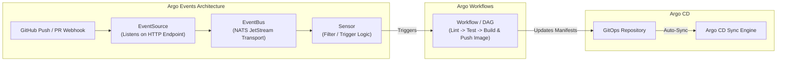
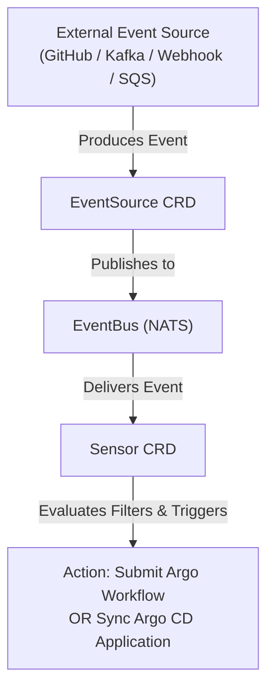

# Lesson 0020: Pipelines and event-driven automation with Argo Workflows and Argo Events

## 1. The Argo CI/CD architecture

While Argo CD handles Continuous Delivery (CD) and GitOps reconciliation, two related needs exist in automated software delivery:
1. **Container workflow execution (CI / Pipelines):** Building code, executing automated test suites, and orchestrating data processing tasks.
2. **Event-driven automation:** Reacting to external webhooks, Kafka messages, cloud pub/sub events, or object storage changes in real time.

The Argo project provides two specialized controllers for these workloads: **Argo Workflows** and **Argo Events**.



---

## 2. Argo Workflows: Kubernetes-native DAGs and CI

**Argo Workflows** executes each pipeline task inside its own container and Pod. It supports Directed Acyclic Graphs (DAGs), artifact storage (S3, GCS, MinIO), and step retries.

### Core custom resources
- **`Workflow`**: A single execution instance of a pipeline.
- **`WorkflowTemplate`**: A reusable, parameterized pipeline definition stored in a namespace.
- **`CronWorkflow`**: Scheduled workflows for periodic jobs (such as nightly builds or database backups).

### Example: CI pipeline with DAGs
```yaml
apiVersion: argoproj.io/v1alpha1
kind: Workflow
metadata:
  generateName: ci-pipeline-
  namespace: argo
spec:
  entrypoint: build-and-test-dag
  templates:
  - name: build-and-test-dag
    dag:
      tasks:
      - name: lint-code
        template: run-linter
      - name: unit-tests
        template: run-tests
      - name: build-docker-image
        dependencies: [lint-code, unit-tests]
        template: kaniko-build

  - name: run-linter
    container:
      image: golangci/golangci-lint:v1.54
      command: [golangci-lint]
      args: ["run"]

  - name: run-tests
    container:
      image: golang:1.21
      command: [go]
      args: ["test", "-v", "./..."]

  - name: kaniko-build
    container:
      image: gcr.io/kaniko-project/executor:latest
      args:
        - "--context=git://github.com/my-org/auth-service.git"
        - "--destination=ghcr.io/my-org/auth-service:latest"
```

---

## 3. Argo Events: Event-driven framework

**Argo Events** translates external events into Kubernetes operations. Its design uses three decoupled components:



1. **`EventSource`**: Configures listeners for external event producers (such as GitHub webhooks, Slack interactions, S3 bucket drops, or Kafka topics).
2. **`EventBus`**: The transport bus connecting EventSources to Sensors, backed by a NATS JetStream cluster.
3. **`Sensor`**: Consumes messages from the EventBus, evaluates filtering conditions, and triggers actions (such as submitting an Argo Workflow or synchronizing an Argo CD Application).

---

## 4. End-to-end event trigger example

### A. The EventSource (Webhook listener)
```yaml
apiVersion: argoproj.io/v1alpha1
kind: EventSource
metadata:
  name: github-eventsource
  namespace: argo-events
spec:
  webhook:
    github-webhook:
      port: "12000"
      endpoint: /push-event
      method: POST
```

### B. The Sensor (Triggering a workflow on main branch push)
```yaml
apiVersion: argoproj.io/v1alpha1
kind: Sensor
metadata:
  name: github-sensor
  namespace: argo-events
spec:
  template:
    serviceAccountName: argo-events-sa
  dependencies:
    - name: github-dep
      eventSourceName: github-eventsource
      eventName: github-webhook
      filters:
        data:
          - path: body.ref
            type: string
            value:
              - refs/heads/main
  triggers:
    - template:
        name: trigger-build
        k8s:
          operation: create
          source:
            resource:
              apiVersion: argoproj.io/v1alpha1
              kind: Workflow
              metadata:
                generateName: github-push-build-
              spec:
                entrypoint: run-ci
                templates:
                - name: run-ci
                  container:
                    image: alpine:latest
                    command: [echo, "Triggered CI build for commit on main!"]
```

---

## Test your knowledge

1. In Argo Events, which component is responsible for filtering event payloads and executing target actions?
   - [ ] A) The Sensor custom resource
   - [ ] B) The EventSource custom resource
   
   Answer: A. The Sensor subscribes to events, evaluates matching criteria and payload filters, and dispatches target triggers.

2. In an Argo Workflow DAG template, what keyword specifies that a task cannot run until previous tasks pass?
   - [ ] A) The dependencies parameter list
   - [ ] B) The sync-wave parameter string
   
   Answer: A. DAG tasks declare `dependencies: [task-a, task-b]` to define execution order and prerequisite steps.

---

## Hands-on practice: Submitting an Argo Workflow

### Step 1: Install Argo Workflows in cluster
```bash
# Create namespace and apply install manifests
kubectl create namespace argo
kubectl apply -n argo -f https://github.com/argoproj/argo-workflows/releases/latest/download/install.yaml

# Grant default service account permissions for development
kubectl create rolebinding default-admin --clusterrole=admin --serviceaccount=argo:default -n argo
```

### Step 2: Submit a test workflow
Save as `hello-workflow.yaml`:
```yaml
apiVersion: argoproj.io/v1alpha1
kind: Workflow
metadata:
  generateName: hello-world-
  namespace: argo
spec:
  entrypoint: whalesay
  templates:
  - name: whalesay
    container:
      image: docker/whalesay:latest
      command: [cowsay]
      args: ["Hello from Argo Workflows!"]
```

```bash
# Submit the workflow
kubectl create -f hello-workflow.yaml

# Watch the pod execute
kubectl get pods -n argo -w
```

---

## Recommended primary resources
- [Argo Workflows documentation](https://argo-workflows.readthedocs.io/)
- [Argo Events architecture guide](https://argoproj.github.io/argo-events/)

---

[← Lesson 19: Progressive delivery with Argo Rollouts](./0019-argo-rollouts-progressive-delivery.md) | [Lesson 21: Flux CD architecture and automated Git write-backs →](./0021-fluxcd-fundamentals-and-architecture.md)
