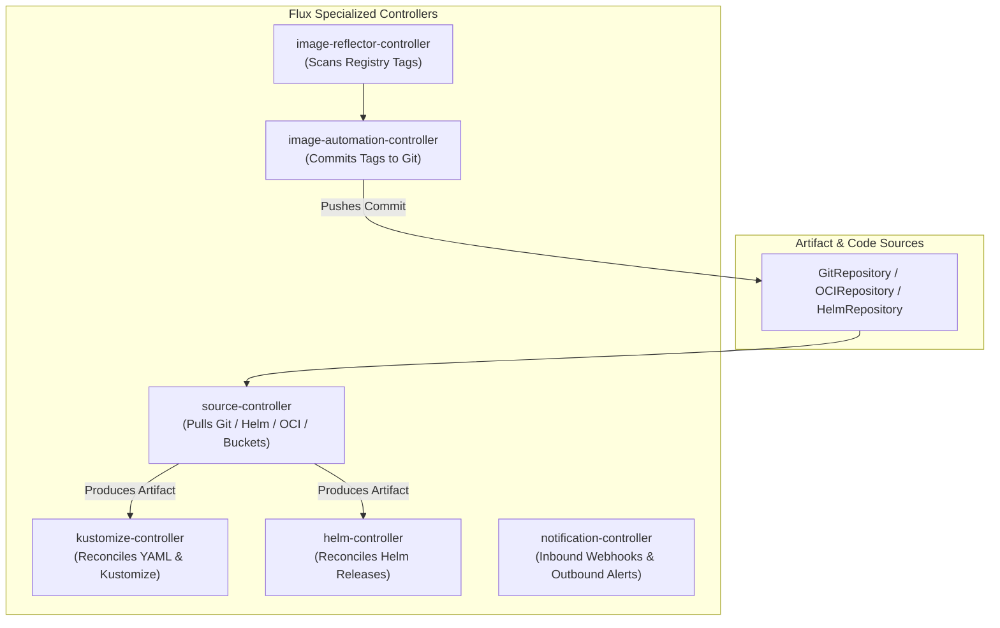

# Lesson 0021: Flux CD architecture and automated Git write-backs

## 1. What is Flux CD?

**Flux** is a CNCF Graduated GitOps toolkit built around Kubernetes Custom Resource Definitions and specialized controllers.

Unlike Argo CD, which includes a centralized application server and web UI, **Flux v2 is a decentralized set of composable controllers**. Each controller manages a specific part of the GitOps delivery lifecycle.



---

## 2. Core Flux custom resources

Flux represents the delivery workflow through declarative custom resources:

| Resource kind | Controller | Purpose |
| :--- | :--- | :--- |
| **`GitRepository`** | `source-controller` | Defines the source Git repository, branch, tag, and polling interval. |
| **`OCIRepository`** | `source-controller` | Pulls Kubernetes manifests packaged as OCI artifacts directly from container registries. |
| **`Kustomization`** | `kustomize-controller` | Defines the directory in the source repository to build and apply, with health checks and dependencies. |
| **`HelmRepository`** | `source-controller` | Registers an HTTP or OCI-based Helm chart repository. |
| **`HelmRelease`** | `helm-controller` | Manages the installation, upgrades, and values of a Helm chart. |

---

## 3. Declarative Flux manifests

### A. Defining a Git source and Kustomization
Flux separates the source location (`GitRepository`) from the reconciliation target (`Kustomization`):

```yaml
# 1. Source Definition
apiVersion: source.toolkit.fluxcd.io/v1
kind: GitRepository
metadata:
  name: fleet-infra
  namespace: flux-system
spec:
  interval: 1m
  url: https://github.com/my-org/fleet-infra
  ref:
    branch: main
---
# 2. Reconciler Definition
apiVersion: kustomize.toolkit.fluxcd.io/v1
kind: Kustomization
metadata:
  name: apps-prod
  namespace: flux-system
spec:
  interval: 5m
  targetNamespace: production
  sourceRef:
    kind: GitRepository
    name: fleet-infra
  path: ./apps/production
  prune: true
  wait: true
  timeout: 3m
```

### B. Declarative Helm chart deployment
```yaml
apiVersion: source.toolkit.fluxcd.io/v1
kind: HelmRepository
metadata:
  name: bitnami
  namespace: flux-system
spec:
  interval: 1h
  url: https://charts.bitnami.com/bitnami
---
apiVersion: helm.toolkit.fluxcd.io/v2beta2
kind: HelmRelease
metadata:
  name: redis-cache
  namespace: caching
spec:
  interval: 30m
  chart:
    spec:
      chart: redis
      version: '18.x'
      sourceRef:
        kind: HelmRepository
        name: bitnami
        namespace: flux-system
  values:
    architecture: standalone
    auth:
      enabled: false
```

---

## 4. Flux automated image updates

Flux automates Git write-backs through two cooperating controllers:
1. **`ImageRepository` / `ImagePolicy`**: Scans the container registry and selects the latest tag matching semantic versioning or regex rules.
2. **`ImageUpdateAutomation`**: Parses your manifests in Git, finds setters (such as `{"$imagepolicy": "flux-system:my-app"}`), updates the YAML, and pushes a commit back to Git.

```yaml
apiVersion: image.toolkit.fluxcd.io/v1beta2
kind: ImagePolicy
metadata:
  name: backend-api
  namespace: flux-system
spec:
  imageRepositoryRef:
    name: backend-api
  policy:
    semver:
      range: '>=1.2.0 <2.0.0'
---
apiVersion: image.toolkit.fluxcd.io/v1beta1
kind: ImageUpdateAutomation
metadata:
  name: flux-system
  namespace: flux-system
spec:
  interval: 1m
  sourceRef:
    kind: GitRepository
    name: fleet-infra
  git:
    checkout:
      ref:
        branch: main
    commit:
      author:
        email: fluxcdbot@users.noreply.github.com
        name: fluxcdbot
      messageTemplate: 'chore(image): update {{range .Updated.Images}}{{..}}{{end}}'
    push:
      branch: main
  update:
    path: ./apps/production
    strategy: Setters
```

---

## 5. Multi-tenancy and security isolation

Flux handles tenant isolation through Kubernetes **Service Account impersonation**. You can configure a tenant's `Kustomization` or `HelmRelease` to reconcile using only the permissions granted to their specific ServiceAccount:

```yaml
apiVersion: kustomize.toolkit.fluxcd.io/v1
kind: Kustomization
metadata:
  name: team-billing
  namespace: team-billing
spec:
  serviceAccountName: billing-deployer # Impersonates this SA during reconciliation
  sourceRef:
    kind: GitRepository
    name: billing-repo
  path: ./manifests
  prune: true
```

---

## Test your knowledge

1. In Flux v2, which controller is responsible for fetching artifacts from Git, Helm registries, and S3 buckets?
   - [ ] A) The source-controller component
   - [ ] B) The kustomize-controller component
   
   Answer: A. `source-controller` acts as the artifact acquisition engine across Git, Helm, and OCI repositories.

2. How does Flux enforce multi-tenant security when reconciling manifests for different development teams?
   - [ ] A) By impersonating tenant service accounts
   - [ ] B) By restarting cluster kubelet services
   
   Answer: A. Flux enforces RBAC boundaries by impersonating a team-specific ServiceAccount when applying resources.

---

## Hands-on practice: Inspecting Flux controller resources

### Step 1: Flux CLI inspection commands
```bash
# Check overall status of all Flux components
flux check

# List all tracked Git repositories and their current commit SHAs
flux get sources git

# List all Helm releases and their status
flux get helmreleases -A

# List all Kustomizations and their health
flux get kustomizations -A
```

### Step 2: Forcing an instant reconciliation
```bash
# Trigger immediate Git repository fetch
flux reconcile source git fleet-infra

# Trigger immediate Kustomization sync with source
flux reconcile kustomization apps-prod --with-source
```

---

## Recommended primary resources
- [Flux CD documentation](https://fluxcd.io/flux/)
- [Flux multi-tenancy guide](https://fluxcd.io/flux/guides/multi-tenancy/)

---

[← Lesson 20: Pipelines and event-driven automation with Argo Workflows and Argo Events](./0020-argo-workflows-and-argo-events.md) | [Lesson 22: Argo CD and Flux CD comparison →](./0022-argocd-vs-fluxcd-comparison.md)
