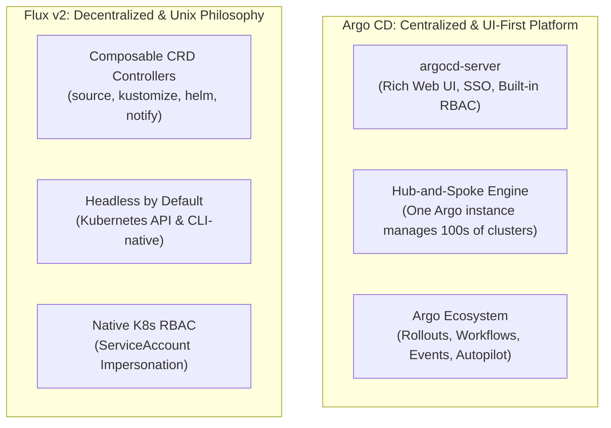
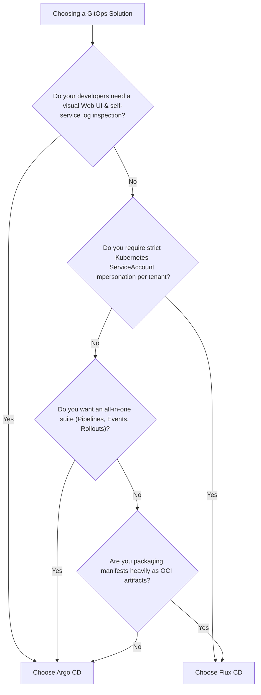

# Lesson 0022: Argo CD and Flux CD comparison

## 1. Architectural philosophies

Both **Argo CD** and **Flux** are CNCF Graduated projects implementing GitOps for Kubernetes. They follow distinct architectural models:

---

## 2. Head-to-head architectural comparison

| Dimension | Argo CD | Flux CD (Flux v2) |
| :--- | :--- | :--- |
| **Design model** | Integrated application delivery platform | Composable, headless Kubernetes controllers |
| **Web dashboard** | Built-in UI (visual tree, logs, terminal, diffs) | Headless by default (optional external UI such as Weave GitOps) |
| **Multi-cluster topology** | Central Argo CD manages remote clusters through API credentials | Flux runs independently inside each cluster |
| **Multi-tenancy and RBAC** | Custom RBAC CSV policies and SSO OIDC | Native Kubernetes RBAC via ServiceAccount impersonation |
| **Helm integration** | Renders charts via `helm template` in repo-server | Full Helm client lifecycle via dedicated `helm-controller` |
| **OCI artifact support** | Supported via custom plugins and OCI registries | Native `OCIRepository` support across all controllers |
| **Automated image updates** | Via `argocd-image-updater` add-on | Built-in `image-reflector` and `image-automation` controllers |
| **Progressive delivery** | Argo Rollouts (`Rollout` CRD + AnalysisTemplate) | Flagger (Canary / Blue-Green with Istio/Linkerd/Nginx) |
| **Workflow / CI engine** | Ecosystem integration: Argo Workflows and Events | Relies on external CI runners (GitHub Actions, Tekton) |

---

## 3. Core trade-offs

### A. Developer experience and visibility
- **Argo CD** fits organizations prioritizing developer self-service. Developers can log into the UI, inspect resource trees, review real-time pod logs, check live diffs, and trigger syncs without direct `kubectl` cluster access.
- **Flux** fits infrastructure teams that prefer a headless model where developers interact entirely through Git pull requests and standard `kubectl` CLI commands.

### B. Security and multi-tenant boundaries
- **Flux** builds on the native Kubernetes security model. By assigning each tenant a `ServiceAccount` and having Flux impersonate it, platform teams enforce RBAC boundaries with standard Kubernetes roles.
- **Argo CD** provides an internal RBAC model, managing multi-tenant team boundaries through `AppProject` CRDs and Argo RBAC ConfigMaps.

---

## 4. Production decision criteria

### Choose Argo CD if
1. Developers require a visual UI for deployment state and real-time pod logs.
2. You manage many spoke clusters from a central control cluster.
3. You plan to use the broader Argo ecosystem (Argo Rollouts, Workflows, and Events).
4. You want visual diff reviews before manual synchronization.

### Choose Flux CD if
1. You want a headless GitOps setup where teams operate entirely through Git.
2. You prefer a smaller footprint without centralized application servers.
3. You distribute manifests and Helm charts as OCI artifacts in container registries.
4. You want native Kubernetes ServiceAccount impersonation for tenant RBAC.

---

## Test your knowledge

1. Which GitOps engine provides a full-featured visual web dashboard and pod log viewer out of the box?
   - [ ] A) The Argo CD platform
   - [ ] B) The Flux CD platform
   
   Answer: A. Argo CD includes an integrated real-time Web UI for visualization, diff inspection, and log viewing.

2. How does Flux CD enforce tenant access restrictions when reconciling cluster manifests?
   - [ ] A) Through native Kubernetes ServiceAccount impersonation
   - [ ] B) Through external firewall network security policies
   
   Answer: A. Flux impersonates designated tenant ServiceAccounts to verify that reconciliations observe standard Kubernetes RBAC limits.

---

## Module 3 review checklist

Key GitOps concepts covered in Module 3:

- [x] **GitOps foundations:** Pull vs. Push CI/CD, drift detection, self-healing, and App of Apps ([Lesson 14](0014-gitops-principles-and-argocd-fundamentals.md)).
- [x] **Manifest templating:** Helm, Kustomize overlays, sync waves, and Pre/PostSync hooks ([Lesson 15](0015-argo-helm-kustomize-sync-waves.md)).
- [x] **Multi-cluster management:** Dynamic ApplicationSets with Matrix and Cluster generators ([Lesson 16](0016-argo-applicationsets.md)).
- [x] **Secret and image automation:** Argo CD Vault Plugin (AVP) and Argo CD Image Updater ([Lesson 17](0017-argocd-image-updater-and-vault-plugin.md)).
- [x] **Production repository layouts:** Autopilot bootstrapping and AppProjects ([Lesson 18](0018-argocd-autopilot-repo-structure.md)).
- [x] **Progressive delivery:** Canary releases, Blue/Green, and metric analysis with Argo Rollouts ([Lesson 19](0019-argo-rollouts-progressive-delivery.md)).
- [x] **Event automation and CI:** Kubernetes-native DAGs and webhooks with Argo Workflows & Events ([Lesson 20](0020-argo-workflows-and-argo-events.md)).
- [x] **Flux v2 architecture:** Controller composition, HelmRelease, OCI sources, and image automation ([Lesson 21](0021-fluxcd-fundamentals-and-architecture.md)).
- [x] **Ecosystem selection:** Production trade-offs and decision criteria for Argo CD vs. Flux ([Lesson 22](0022-argocd-vs-fluxcd-comparison.md)).

---

## Recommended primary resources
- [CNCF GitOps landscape](https://landscape.cncf.io/card-mode?category=continuous-integration-delivery&grouping=no)
- [Argo Project](https://argoproj.github.io/)
- [Flux CD documentation](https://fluxcd.io/)

---

[← Lesson 21: Flux CD architecture and automated Git write-backs](./0021-fluxcd-fundamentals-and-architecture.md) | [Lesson 23: KEDA fundamentals and autoscaling architecture →](./0023-keda-fundamentals-and-architecture.md)
