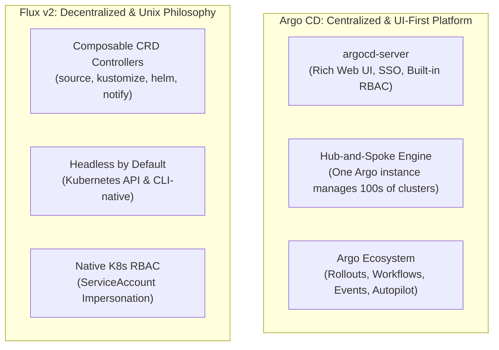
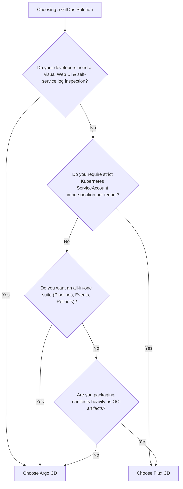

# Lesson 22: Argo CD vs. Flux CD Deep Comparison & Production Selection Guide

## 1. The Two Titans of Cloud-Native GitOps

Both **Argo CD** and **Flux** are CNCF Graduated projects and represent the pinnacle of production-grade GitOps for Kubernetes. However, they are built with fundamentally different architectural philosophies:

---

## 2. Head-to-Head Architectural Comparison

| Dimension | Argo CD | Flux CD (Flux v2) |
| :--- | :--- | :--- |
| **Primary Philosophy** | Integrated application delivery platform | Composable, headless Kubernetes controllers |
| **Web Dashboard** | **First-Class Built-in UI** (visual tree, logs, terminal, diffs) | **Headless by default** (requires external UI like Weave GitOps) |
| **Multi-Cluster Architecture** | **Hub & Spoke:** Central Argo CD manages remote clusters via API secrets | **Decentralized:** Flux runs independently inside each cluster |
| **Multi-Tenancy & RBAC** | Custom RBAC CSV policies + SSO OIDC (Dex) | Native Kubernetes RBAC via **ServiceAccount Impersonation** |
| **Helm Integration** | Renders charts via `helm template` in repo-server | Full Helm client lifecycle via dedicated `helm-controller` |
| **OCI Artifact Support** | Supported via custom plugins / OCI registries | **First-class native `OCIRepository`** support across all controllers |
| **Automated Image Updates** | Via `argocd-image-updater` add-on | Built-in native `image-reflector` & `image-automation` controllers |
| **Progressive Delivery** | **Argo Rollouts** (`Rollout` CRD + AnalysisTemplate) | **Flagger** (Canary / Blue-Green with Istio/Linkerd/Nginx) |
| **Workflow / CI Engine** | Full native ecosystem: **Argo Workflows & Events** | Relies on external CI runners (GitHub Actions, Tekton) |

---

## 3. Deep Dive into Core Trade-offs

### A. Developer Experience & Visibility
- **Argo CD** is the clear winner for organizations prioritizing **developer self-service**. Developers can log into the UI, visualize dependencies, view real-time pod logs, inspect live diffs, and manually trigger syncs without needing `kubectl` access.
- **Flux** appeals to infrastructure teams that prefer a **headless, zero-extra-UI** approach where developers interact exclusively through Git pull requests and standard `kubectl` CLI commands.

### B. Security & Multi-Tenant Boundaries
- **Flux** integrates deeply with Kubernetes' native security model. By assigning each tenant a `ServiceAccount` and having Flux impersonate it, platform teams can enforce strict RBAC boundaries using standard Kubernetes roles.
- **Argo CD** provides a powerful internal RBAC model, but managing fine-grained multi-tenant project permissions across hundreds of teams requires configuring `AppProject` CRDs and Argo RBAC ConfigMaps.

---

## 4. Production Decision Matrix: Which Should You Choose?

### Choose Argo CD if:
1. You have many developers who need visual insight into their deployments and real-time pod logs.
2. You manage hundreds of spoke clusters from a single centralized management cluster.
3. You want to leverage the extended Argo ecosystem (**Argo Rollouts**, **Workflows**, and **Events**).
4. You need visual diff inspection before approving a synchronization.

### Choose Flux CD if:
1. You follow a pure GitOps philosophy where developers never touch a web dashboard.
2. You want a lightweight footprint without centralized servers or databases.
3. You heavily utilize OCI registries to distribute Kubernetes configurations and Helm charts.
4. You want native Kubernetes ServiceAccount RBAC impersonation for tenant isolation.

---

## Test Your Knowledge

1. Which GitOps engine provides a full-featured visual web dashboard and pod log viewer out of the box?
   - [ ] A) The Argo CD platform
   - [ ] B) The Flux CD platform
   
   *Answer:* A) The Argo CD platform - Correct! Argo CD includes an integrated real-time Web UI for visualization, diff viewing, and log inspection.

2. How does Flux CD enforce tenant access restrictions when reconciling cluster manifests?
   - [ ] A) Through native Kubernetes ServiceAccount impersonation
   - [ ] B) Through external firewall network security policies
   
   *Answer:* A) Through native Kubernetes ServiceAccount impersonation - Correct! Flux impersonates designated tenant ServiceAccounts to guarantee that reconciliations observe standard Kubernetes RBAC limits.

---

## Module Capstone: Complete GitOps Architectural Review

Congratulations! You have completed the **Kubernetes GitOps & Progressive Delivery Module**. You now have full command over:

- [x] **GitOps Foundations:** Pull vs. Push CI/CD, Drift Detection, Self-Healing, and App of Apps ([Lesson 14](0014-gitops-principles-and-argocd-fundamentals.md)).
- [x] **Manifest Templating:** Helm, Kustomize overlays, Sync Waves, and Pre/PostSync Hooks ([Lesson 15](0015-argo-helm-kustomize-sync-waves.md)).
- [x] **Multi-Cluster Scalability:** Dynamic ApplicationSets with Matrix and Cluster generators ([Lesson 16](0016-argo-applicationsets.md)).
- [x] **Secret & Image Automation:** Argo CD Vault Plugin (AVP) and Argo CD Image Updater ([Lesson 17](0017-argocd-image-updater-and-vault-plugin.md)).
- [x] **Production Repo Layouts:** Enterprise Autopilot bootstrapping and AppProjects ([Lesson 18](0018-argocd-autopilot-repo-structure.md)).
- [x] **Progressive Delivery:** Canary releases, Blue/Green, and automated Prometheus analysis with Argo Rollouts ([Lesson 19](0019-argo-rollouts-progressive-delivery.md)).
- [x] **Event Automation & CI:** Kubernetes-native DAGs and webhooks with Argo Workflows & Events ([Lesson 20](0020-argo-workflows-and-argo-events.md)).
- [x] **Flux v2 Architecture:** Microservice controllers, HelmRelease, OCI sources, and image automation ([Lesson 21](0021-fluxcd-fundamentals-and-architecture.md)).
- [x] **Ecosystem Selection:** Production trade-offs and decision criteria for Argo CD vs. Flux ([Lesson 22](0022-argocd-vs-fluxcd-comparison.md)).

---

## Recommended Primary Resource
- [CNCF GitOps Landscape](https://landscape.cncf.io/card-mode?category=continuous-integration-delivery&grouping=no)
- [Argo Project Ecosystem Home](https://argoproj.github.io/)
- [Flux CD Documentation & Architecture](https://fluxcd.io/)

---
**Looking to build a custom GitOps pipeline or evaluate enterprise tools?** Let us know in chat, and we'll help you architect the ideal solution!

[← Lesson 21: Flux CD Architecture & Image Automation](./0021-fluxcd-fundamentals-and-architecture.md) | [Lesson 23: KEDA Fundamentals & Architecture →](./0023-keda-fundamentals-and-architecture.md)
