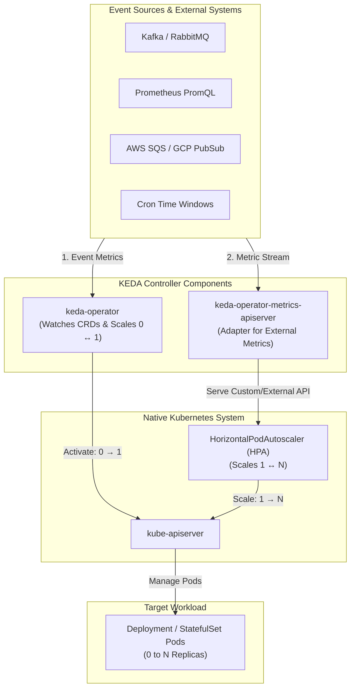
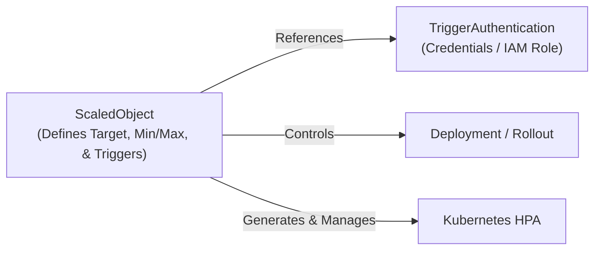

# Lesson 0023: KEDA fundamentals and autoscaling architecture

## 1. What is KEDA?

**KEDA** (Kubernetes Event-driven Autoscaling) is a CNCF Graduated project that provides event-driven autoscaling for container workloads. While native Kubernetes scaling primarily monitors resource consumption (CPU and memory), KEDA scales workloads based on external signals: message queue depth, database query counts, HTTP request rates, or cron schedules.

KEDA also enables **scale-to-zero (`0 ↔ N`)**, allowing workloads to scale down completely when idle and reactivate on the first incoming event.



---

## 2. KEDA versus native Kubernetes HPA

The native Kubernetes `HorizontalPodAutoscaler` (HPA) has two main operational constraints:

1. **Cannot scale to zero replicas:** Standard HPA requires at least 1 replica running (`minReplicas: 1`) to collect CPU and memory metrics.
2. **Limited external metric awareness:** Native HPA does not natively poll message brokers or cloud databases without custom metric adapters.

| Capability | Native Kubernetes HPA | KEDA (with HPA) |
| :--- | :--- | :--- |
| **Metric types** | CPU, Memory, standard Custom Metrics | 60+ Built-in Scalers (Kafka, SQS, RabbitMQ, Cron, Prometheus, Redis) |
| **Scale to zero (`0` replicas)** | No (Minimum `minReplicas: 1`) | Yes (Full scale-to-zero when queues are empty) |
| **Scale from zero (`0 → 1`)** | No | Yes (KEDA Operator activates workload on first event) |
| **Scale from 1 to N (`1 → N`)** | Yes (Via standard HPA) | Yes (KEDA provisions and manages an underlying HPA) |
| **Batch / Job scaling** | Deployments and StatefulSets only | Deployments, StatefulSets, Custom Resources, and **`ScaledJobs`** |

---

## 3. Core architectural components

KEDA installs into the cluster (typically in the `keda` namespace) and consists of three services:

### 1. `keda-operator`
- Watches KEDA custom resources (`ScaledObject`, `ScaledJob`, `TriggerAuthentication`).
- Manages **0-to-1 and 1-to-0 transitions**:
  - When no events exist, it sets the target Deployment's `spec.replicas` to `0`.
  - When an event arrives, it scales the Deployment from `0` to `1`.
- Manages the lifecycle of a corresponding native `HorizontalPodAutoscaler` (HPA) for `1 ↔ N` scaling.

### 2. `keda-operator-metrics-apiserver`
- Implements the Kubernetes External Metrics API specification.
- Queries external systems (such as Redis, Kafka, Datadog, Prometheus) and translates their values into metrics that the native HPA controller consumes.

### 3. `keda-admission-webhooks`
- Validates the syntax and configuration of `ScaledObject` and `ScaledJob` resources before admission.

---

## 4. Key custom resource definitions (CRDs)



1. **`ScaledObject`**: Defines the mapping between an event source (triggers), the target workload (`scaleTargetRef`), and scaling bounds (`minReplicaCount`, `maxReplicaCount`, `cooldownPeriod`, `pollingInterval`).
2. **`ScaledJob`**: Defines event-driven batch processing where Kubernetes `Job` resources are launched per event instead of long-running Pods.
3. **`TriggerAuthentication`**: Defines the credentials (secrets, API keys, IAM roles) required to connect to external event sources in the same namespace.
4. **`ClusterTriggerAuthentication`**: Cluster-wide credentials shared across multiple namespaces.

---

## 5. Declarative ScaledObject blueprint

Below is a `ScaledObject` that scales a worker deployment based on queue depth:

```yaml
apiVersion: keda.sh/v1alpha1
kind: ScaledObject
metadata:
  name: order-processor-scaler
  namespace: e-commerce
spec:
  scaleTargetRef:
    apiVersion: apps/v1
    kind: Deployment
    name: order-processor-worker
  pollingInterval: 15                 # Check event source every 15 seconds
  cooldownPeriod:  300                # Wait 5 minutes of 0 events before scaling to 0
  minReplicaCount: 0                  # Scale to 0 when queue is empty
  maxReplicaCount: 30                 # Maximum burst capacity
  advanced:
    restoreToOriginalReplicaCount: true # Restores initial replica count if ScaledObject is deleted
  triggers:
    - type: prometheus
      metadata:
        serverAddress: http://prometheus-k8s.monitoring.svc:9090
        metricName: pending_orders_count
        query: sum(orders_queue_pending_total)
        threshold: '10'               # Scale 1 pod for every 10 pending orders
        activationThreshold: '1'      # Scale from 0 to 1 when at least 1 order arrives
```

---

## Test your knowledge

1. Why does KEDA split scaling responsibility between the KEDA Operator and the Kubernetes native HPA?
   - [ ] A) Operator manages 0-to-1 activations while HPA manages 1-to-N scaling
   - [ ] B) Operator manages CPU metrics while HPA handles external queue systems
   
   Answer: A. Standard HPA cannot scale workloads to or from 0, so KEDA's operator manages `spec.replicas` directly for 0 $\leftrightarrow$ 1 transitions and delegates 1 $\leftrightarrow$ N scaling to HPA.

2. Which KEDA component acts as an external metrics adapter to feed event metrics to the Kubernetes HPA controller?
   - [ ] A) The keda-operator-metrics-apiserver service
   - [ ] B) The keda-admission-webhooks controller
   
   Answer: A. The metrics server implements the Kubernetes External Metrics API to serve real-time external data to the HPA controller.

---

## Hands-on practice: Inspecting KEDA custom resources

### Step 1: Verify KEDA controller pods
```bash
# Check that the operator and metrics adapter are running
kubectl get pods -n keda -l app.kubernetes.io/name=keda-operator
kubectl get pods -n keda -l app.kubernetes.io/name=keda-operator-metrics-apiserver
```

### Step 2: Inspect ScaledObjects and synthesized HPAs
```bash
# List all ScaledObjects
kubectl get scaledobject -A

# View the underlying HPA generated by KEDA
kubectl get hpa -A

# Describe the ScaledObject to inspect trigger status
kubectl describe scaledobject order-processor-scaler -n e-commerce
```

---

## Recommended primary resources
- [KEDA documentation and concepts](https://keda.sh/docs/latest/concepts/)
- [CNCF KEDA project overview](https://www.cncf.io/projects/keda/)

---

[← Lesson 22: Argo CD and Flux CD comparison](./0022-argocd-vs-fluxcd-comparison.md) | [Lesson 24: Workload scaling with external metric triggers →](./0024-keda-external-metrics-scalers.md)
