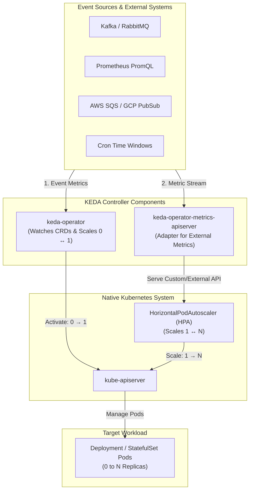
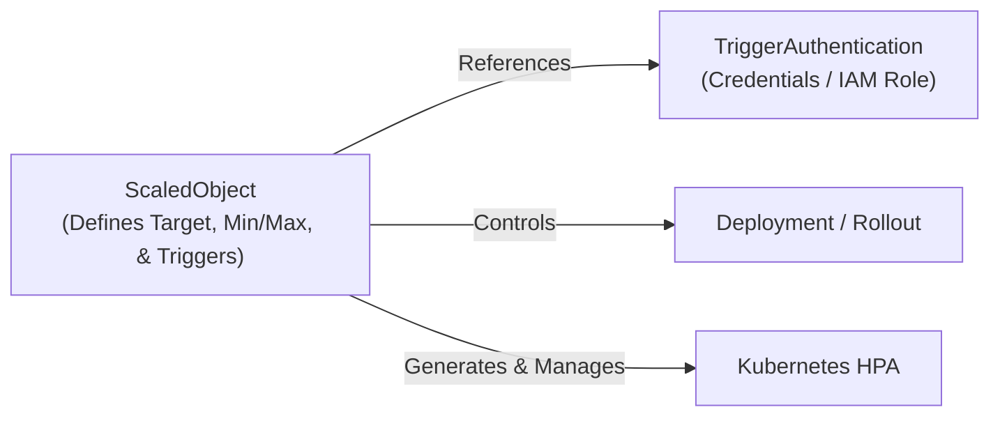

# Lesson 23: KEDA Fundamentals & Event-Driven Autoscaling Architecture

## 1. What is KEDA?

**KEDA** (Kubernetes Event-driven Autoscaling) is a CNCF Graduated project that provides event-driven autoscaling for any container workload in Kubernetes. While native Kubernetes scaling is primarily tied to resource metrics (CPU and Memory utilization), KEDA allows workloads to scale dynamically based on real-world events and external metrics—such as message queue depth, database query counts, HTTP traffic rates, or time-of-day schedules.

Crucially, KEDA solves one of the biggest limitations of standard Kubernetes autoscaling: **scaling to and from zero replicas (`0 ↔ N`)**.



---

## 2. KEDA vs. Native Kubernetes HPA

The native Kubernetes `HorizontalPodAutoscaler` (HPA) is a powerful resource, but it has two primary constraints in production:

1. **Cannot Scale to Zero (0 Replicas):** Standard HPA requires at least 1 replica running (`minReplicas: 1`) so that resource metrics (CPU/Memory) can be collected. It cannot shut idle workloads down to 0 to eliminate cloud computing costs.
2. **Limited Event Awareness:** Native HPA has no direct understanding of external queues, cloud message brokers, or custom Prometheus metrics without deploying complex custom metrics adapters.

| Capability | Native Kubernetes HPA | KEDA (with HPA) |
| :--- | :--- | :--- |
| **Metric Types** | CPU, Memory, standard Custom Metrics | 60+ Built-in Scalers (Kafka, SQS, RabbitMQ, Cron, Prometheus, Redis, etc.) |
| **Scale to Zero (`0` replicas)** | :x: No (Minimum `minReplicas: 1`) | :white_check_mark: Yes (Full scale-to-zero when queues/events are empty) |
| **Scale from Zero (`0 → 1`)** | :x: No | :white_check_mark: Yes (KEDA Operator activates workload on first event) |
| **Scale from 1 to N (`1 → N`)** | :white_check_mark: Yes (Via standard HPA) | :white_check_mark: Yes (KEDA automatically provisions & tunes an underlying HPA) |
| **Batch / Job Scaling** | :x: Deployments/StatefulSets only | :white_check_mark: Deployments, StatefulSets, Custom Resources, and **`ScaledJobs`** |

---

## 3. Core Architectural Components

KEDA installs into the cluster (typically in the `keda` namespace) and consists of three key architectural services:

### 1. `keda-operator`
- Watches KEDA Custom Resource Definitions (`ScaledObject`, `ScaledJob`, `TriggerAuthentication`).
- Responsible for **Scale-to-Zero and Scale-from-Zero** (`0 ↔ 1`):
  - When no events exist, it directly modifies the target Deployment's `spec.replicas` to `0`.
  - When an event arrives, it intercepts the metric and scales the Deployment from `0` to `1`.
- Automatically synthesizes and manages the lifecycle of a corresponding native Kubernetes `HorizontalPodAutoscaler` (HPA) for `1 ↔ N` scaling.

### 2. `keda-operator-metrics-apiserver`
- Implements the Kubernetes External Metrics API specification.
- Acts as a dynamic translation bridge: it queries external systems (e.g., Redis, Kafka, Datadog, Prometheus) and translates their numbers into external metrics that the native Kubernetes HPA controller can digest.

### 3. `keda-admission-webhooks`
- Validates the syntax, credentials, and configuration of `ScaledObject` and `ScaledJob` resources before they are admitted into `etcd`.

---

## 4. Key Custom Resource Definitions (CRDs)

KEDA introduces four primary CRDs:



1. **`ScaledObject`**: Defines the mapping between an event source (triggers), the target workload (`scaleTargetRef` like a Deployment, StatefulSet, or Argo Rollout), and scaling boundaries (`minReplicaCount`, `maxReplicaCount`, `cooldownPeriod`, `pollingInterval`).
2. **`ScaledJob`**: Defines event-driven batch processing where Kubernetes `Job` objects are launched per event/message instead of long-running Pods.
3. **`TriggerAuthentication`**: Contains or references the authentication credentials (secrets, API keys, IAM roles) required to connect to external systems in the same namespace.
4. **`ClusterTriggerAuthentication`**: Cluster-wide authentication credentials that can be shared across multiple namespaces.

---

## 5. Declarative ScaledObject Blueprint

Here is a minimal `ScaledObject` that scales a worker deployment based on queue depth:

```yaml
apiVersion: keda.sh/v1alpha1
kind: ScaledObject
metadata:
  name: order-processor-scaler
  namespace: e-commerce
spec:
  scaleTargetRef:
    apiVersion: apps/v1
    kind: Deployment
    name: order-processor-worker
  pollingInterval: 15                 # Check event source every 15 seconds
  cooldownPeriod:  300                # Wait 5 minutes of 0 events before scaling to 0
  minReplicaCount: 0                  # Scale to 0 when queue is empty!
  maxReplicaCount: 30                 # Maximum burst capacity
  advanced:
    restoreToOriginalReplicaCount: true # Restores initial replica count if ScaledObject is deleted
  triggers:
    - type: prometheus
      metadata:
        serverAddress: http://prometheus-k8s.monitoring.svc:9090
        metricName: pending_orders_count
        query: sum(orders_queue_pending_total)
        threshold: '10'               # Scale 1 pod for every 10 pending orders
        activationThreshold: '1'      # Scale from 0 to 1 when at least 1 order arrives
```

---

## Test Your Knowledge

1. Why does KEDA split scaling responsibility between the KEDA Operator and the Kubernetes native HPA?
   - [ ] A) Operator manages 0-to-1 activations while HPA manages 1-to-N scaling
   - [ ] B) Operator manages CPU metrics while HPA handles external queue systems
   
   *Answer:* A) Operator manages 0-to-1 activations while HPA manages 1-to-N scaling - Correct! Standard HPA cannot scale workloads to or from 0, so KEDA's operator directly manipulates `spec.replicas` for 0 ↔ 1 transitions and leverages native HPA for 1 ↔ N scaling.

2. Which KEDA component acts as an external metrics adapter to feed event metrics to the Kubernetes HPA controller?
   - [ ] A) The keda-operator-metrics-apiserver service
   - [ ] B) The keda-admission-webhooks controller
   
   *Answer:* A) The keda-operator-metrics-apiserver service - Correct! The metrics server implements the Kubernetes External Metrics API to serve real-time external data to the HPA controller.

---

## Interactive Win: Inspecting KEDA Custom Resources

Let's explore essential `kubectl` commands to verify KEDA operator health and examine running ScaledObjects.

### Step 1: Verify KEDA Controller Pods
```bash
# Check that the operator and metrics adapter are healthy
kubectl get pods -n keda -l app.kubernetes.io/name=keda-operator
kubectl get pods -n keda -l app.kubernetes.io/name=keda-operator-metrics-apiserver
```

### Step 2: Inspect ScaledObjects & Synthesized HPAs
```bash
# List all ScaledObjects and check their ACTIVE and READY status
kubectl get scaledobject -A

# View the underlying HPA automatically created by KEDA
kubectl get hpa -A

# Describe the ScaledObject to inspect real-time trigger evaluation
kubectl describe scaledobject order-processor-scaler -n e-commerce
```

---

## Recommended Primary Resource
- [KEDA Official Documentation & Architecture](https://keda.sh/docs/latest/concepts/)
- [CNCF KEDA Project Overview](https://www.cncf.io/projects/keda/)

---
**Questions on KEDA architecture or scale-to-zero mechanics?** Ask in the chat, and we'll dive into specific scaler implementations!

[← Lesson 22: Argo CD vs. Flux CD Deep Comparison](./0022-argocd-vs-fluxcd-comparison.md) | [Lesson 24: KEDA External Metric Triggers →](./0024-keda-external-metrics-scalers.md)
