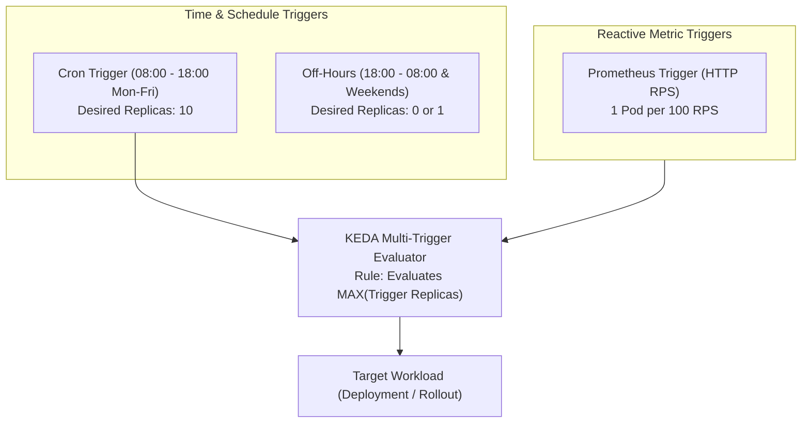

# Lesson 25: Time-Based Autoscaling with KEDA Cron Scaler & Multi-Trigger Composition

## 1. Why Time-Based (Cron) Autoscaling?

Standard autoscaling is **reactive**: it detects increased CPU, memory, or queue depth *after* traffic arrives and takes several minutes to provision new pods and warm application caches.

For many real-world businesses, traffic patterns are highly **predictable**:
- **Enterprise SaaS:** Heavy usage between 8:00 AM and 6:00 PM on weekdays; minimal usage on weekends.
- **FinTech / Trading:** Massive surges at market opening bell (e.g., 9:15 AM).
- **E-Commerce:** Pre-scheduled flash sales, promotional campaigns, or marketing email blasts.
- **Batch Processing Windows:** Nightly ETL data pipelines between 1:00 AM and 4:00 AM.

The **KEDA Cron Scaler** enables **proactive pre-warming**: scaling up capacity *before* the traffic spike hits so that latency remains flat.



---

## 2. Anatomy of the KEDA `cron` Scaler

The `cron` scaler defines a time window during which a specific replica count must be active:

```yaml
triggers:
  - type: cron
    metadata:
      timezone: America/New_York       # Standard IANA Timezone name
      start: 0 8 * * 1-5               # 8:00 AM Monday through Friday
      end: 0 18 * * 1-5                # 6:00 PM Monday through Friday
      desiredReplicas: '15'            # Target replica count during active window
```

### Key Parameters:
- **`timezone`**: Must be a valid IANA Timezone string (e.g., `UTC`, `America/Chicago`, `Europe/London`, `Asia/Kolkata`). Never rely on node server system clocks.
- **`start`**: Standard 5-field cron expression for when the scaling window opens.
- **`end`**: Standard 5-field cron expression for when the scaling window closes.
- **`desiredReplicas`**: Number of pods to maintain while the current time falls between `start` and `end`.

!!! warning "Understanding Cron Active Windows"
    The active window is defined as the time between `start` and `end`. While active, the cron scaler reports `desiredReplicas`. When outside the active window, the scaler reports `0` (or hands over evaluation to other triggers).

---

## 3. Multi-Trigger Composition & Evaluation Rules

In production, you rarely rely solely on Cron or solely on reactive metrics. You combine them!

### How KEDA Resolves Multiple Triggers
When multiple triggers are declared inside a single `ScaledObject`, KEDA calculates the desired replicas for each trigger independently and applies the **MAXIMUM** value:

$$\text{Final Desired Replicas} = \max(\text{Trigger}_1, \text{Trigger}_2, \dots, \text{Trigger}_n)$$

### Scenario Example:
1. **At 7:55 AM (Night):**
   - Cron Trigger: Inactive (`0` desired pods).
   - Prometheus Trigger: Low traffic (`1` desired pod).
   - **Result:** Max(0, 1) = **1 Pod** (Cost savings).
2. **At 8:01 AM (Business Day Starts):**
   - Cron Trigger: Active (`10` desired pods).
   - Prometheus Trigger: Low morning traffic (`2` desired pods).
   - **Result:** Max(10, 2) = **10 Pods** (Pre-warmed and ready for users).
3. **At 2:00 PM (Unexpected Mid-Day Surge):**
   - Cron Trigger: Active (`10` desired pods).
   - Prometheus Trigger: 2,500 RPS spike ($\lceil 2500 / 100 \rceil = 25$ desired pods).
   - **Result:** Max(10, 25) = **25 Pods** (Burst capacity handles surge).

---

## 4. Production Blueprint: Pre-Warming + Real-Time Bursts

Here is an enterprise-grade `ScaledObject` combining timezone-aware pre-warming with reactive Prometheus scaling and fallback protection:

```yaml
apiVersion: keda.sh/v1alpha1
kind: ScaledObject
metadata:
  name: billing-api-scaler
  namespace: finance
spec:
  scaleTargetRef:
    apiVersion: apps/v1
    kind: Deployment
    name: billing-api
  minReplicaCount: 1                  # Minimum baseline off-peak
  maxReplicaCount: 40                 # Absolute ceiling during extreme events
  pollingInterval: 15
  cooldownPeriod: 180
  fallback:
    failureThreshold: 3
    replicas: 5                       # Safe fallback if Prometheus fails
  triggers:
    # Trigger 1: Business Hours Pre-Warming (8 AM to 6 PM EST, Mon-Fri)
    - type: cron
      name: business-hours-schedule
      metadata:
        timezone: America/New_York
        start: 0 8 * * 1-5
        end: 0 18 * * 1-5
        desiredReplicas: '12'

    # Trigger 2: Reactive Traffic Bursting via Prometheus
    - type: prometheus
      name: http-rps-burst
      metadata:
        serverAddress: http://prometheus-operated.monitoring.svc:9090
        metricName: billing_http_rps
        query: sum(rate(http_requests_total{service="billing-api"}[2m]))
        threshold: '80'               # 1 pod per 80 RPS
        activationThreshold: '10'
```

---

## Test Your Knowledge

1. If a `ScaledObject` has a Cron trigger requesting 10 replicas and a Prometheus trigger requesting 18 replicas, what replica count will KEDA enforce?
   - [ ] A) It selects the maximum value of 18 replicas across active triggers
   - [ ] B) It selects the average value of 14 replicas between both triggers
   
   *Answer:* A) It selects the maximum value of 18 replicas across active triggers - Correct! KEDA evaluates all declared triggers concurrently and always chooses the highest replica count calculated.

2. Why is configuring explicit IANA `timezone` values essential when writing KEDA cron triggers?
   - [ ] A) It guarantees scheduled execution aligns with business working hours
   - [ ] B) It forces worker nodes to synchronize their hardware BIOS clocks
   
   *Answer:* A) It guarantees scheduled execution aligns with business working hours - Correct! Cluster nodes frequently run in UTC, so specifying IANA timezones (like `America/New_York`) ensures schedules accurately reflect local business hours.

---

## Interactive Win: Inspecting Scheduled Trigger State

### Step 1: Inspect ScaledObject Detailed Status
```bash
# Check the status of all triggers configured on the ScaledObject
kubectl describe scaledobject billing-api-scaler -n finance
```

Look for the `Triggers` section in the output:
```text
Events:
  Type    Reason             Age   From           Message
  ----    ------             ----  ----           -------
  Normal  KEDAScalersStarted 2m    keda-operator  Started scalers: [business-hours-schedule, http-rps-burst]
  Normal  ScaledObjectReady  2m    keda-operator  ScaledObject is ready for scaling
```

### Step 2: Test Cron Expression Validity
```bash
# Verify the underlying synthesized HPA current metrics and min/max targets
kubectl get hpa keda-hpa-billing-api-scaler -n finance -o yaml
```

---

## Recommended Primary Resource
- [KEDA Cron Scaler Documentation](https://keda.sh/docs/latest/scalers/cron/)
- [KEDA Scaling Logic and Multi-Trigger Resolution](https://keda.sh/docs/latest/concepts/scaling-deployments/)

---
**Working with complex schedules across multiple geographic regions?** Ask in the chat, and we'll configure a multi-cron schedule template!

[← Lesson 24: KEDA External Metric Triggers](./0024-keda-external-metrics-scalers.md) | [Lesson 26: KEDA + Argo CD Drift Resolution →](./0026-keda-argocd-gitops-integration-and-drift.md)
