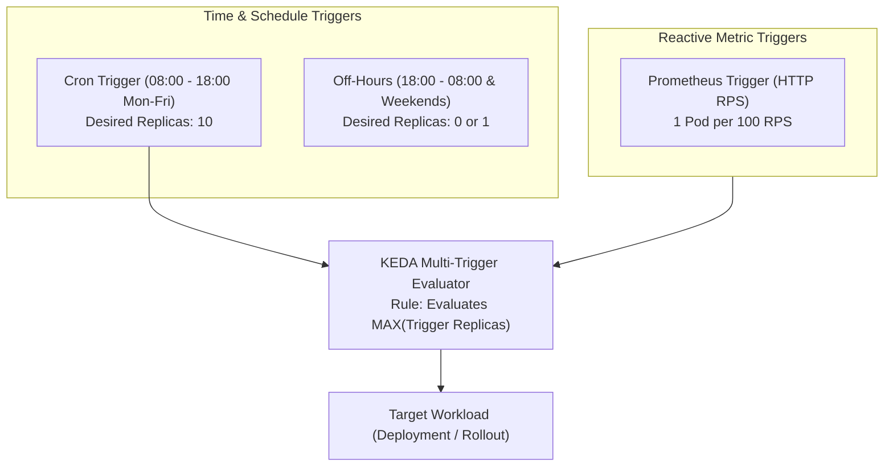

# Lesson 0025: Scheduled autoscaling with Cron scalers and multi-trigger composition

## 1. Why scheduled autoscaling?

Reactive autoscaling adds capacity only after detecting high CPU, memory, or queue depth. This introduces a lag while new nodes provision, images pull, and application caches warm.

Many workloads have predictable traffic patterns:
- **Enterprise SaaS:** High usage between 8:00 AM and 6:00 PM on weekdays; minimal usage on weekends.
- **FinTech / Trading:** Surges around market opening hours.
- **E-Commerce:** Scheduled promotional campaigns or seasonal sales.
- **Batch processing:** Nightly ETL data pipelines.

The **KEDA Cron Scaler** enables **proactive pre-warming**: scaling up capacity before a traffic spike arrives.



---

## 2. Anatomy of the KEDA cron scaler

The `cron` scaler defines a time window during which a specific replica count is maintained:

```yaml
triggers:
  - type: cron
    metadata:
      timezone: America/New_York       # Standard IANA Timezone name
      start: 0 8 * * 1-5               # 8:00 AM Monday through Friday
      end: 0 18 * * 1-5                # 6:00 PM Monday through Friday
      desiredReplicas: '15'            # Target replica count during active window
```

### Key parameters
- **`timezone`**: An IANA Timezone string (such as `UTC`, `America/Chicago`, `Europe/London`, `Asia/Kolkata`).
- **`start`**: Standard 5-field cron expression for when the scaling window opens.
- **`end`**: Standard 5-field cron expression for when the scaling window closes.
- **`desiredReplicas`**: Number of pods to maintain while the current time is between `start` and `end`.

!!! warning "Cron active windows"
    While inside the active window, the cron scaler reports `desiredReplicas`. When outside the window, the scaler reports `0` and yields evaluation to other configured triggers.

---

## 3. Multi-trigger composition and evaluation rules

Production systems frequently combine scheduled scaling with reactive metric triggers.

### How KEDA resolves multiple triggers
When multiple triggers are defined in a `ScaledObject`, KEDA calculates desired replicas for each trigger independently and applies the **maximum** value:

$$\text{Final Desired Replicas} = \max(\text{Trigger}_1, \text{Trigger}_2, \dots, \text{Trigger}_n)$$

### Evaluation scenario
1. **At 7:55 AM (Off-peak):**
   - Cron trigger: Inactive (`0` desired pods).
   - Prometheus trigger: Low traffic (`1` desired pod).
   - Result: Max(0, 1) = **1 Pod**.
2. **At 8:01 AM (Business day begins):**
   - Cron trigger: Active (`10` desired pods).
   - Prometheus trigger: Low morning traffic (`2` desired pods).
   - Result: Max(10, 2) = **10 Pods**.
3. **At 2:00 PM (Mid-day traffic surge):**
   - Cron trigger: Active (`10` desired pods).
   - Prometheus trigger: 2,500 RPS surge ($\lceil 2500 / 100 \rceil = 25$ desired pods).
   - Result: Max(10, 25) = **25 Pods**.

---

## 4. Production blueprint: Pre-warming and real-time bursts

Below is a `ScaledObject` combining timezone-aware pre-warming with reactive Prometheus scaling and fallback protection:

```yaml
apiVersion: keda.sh/v1alpha1
kind: ScaledObject
metadata:
  name: billing-api-scaler
  namespace: finance
spec:
  scaleTargetRef:
    apiVersion: apps/v1
    kind: Deployment
    name: billing-api
  minReplicaCount: 1                  # Minimum baseline off-peak
  maxReplicaCount: 40                 # Absolute ceiling during extreme events
  pollingInterval: 15
  cooldownPeriod: 180
  fallback:
    failureThreshold: 3
    replicas: 5                       # Safe fallback if Prometheus fails
  triggers:
    # Trigger 1: Business Hours Pre-Warming (8 AM to 6 PM EST, Mon-Fri)
    - type: cron
    name: business-hours-schedule
    metadata:
      timezone: America/New_York
      start: 0 8 * * 1-5
      end: 0 18 * * 1-5
      desiredReplicas: '12'

    # Trigger 2: Reactive Traffic Bursting via Prometheus
    - type: prometheus
    name: http-rps-burst
    metadata:
      serverAddress: http://prometheus-operated.monitoring.svc:9090
      metricName: billing_http_rps
      query: sum(rate(http_requests_total{service="billing-api"}[2m]))
      threshold: '80'               # 1 pod per 80 RPS
      activationThreshold: '10'
```

---

## Test your knowledge

1. If a `ScaledObject` has a Cron trigger requesting 10 replicas and a Prometheus trigger requesting 18 replicas, what replica count will KEDA enforce?
   - [ ] A) It selects the maximum value of 18 replicas across active triggers
   - [ ] B) It selects the average value of 14 replicas between both triggers
   
   Answer: A. KEDA evaluates all declared triggers concurrently and applies the highest calculated replica count.

2. Why is configuring explicit IANA `timezone` values essential when writing KEDA cron triggers?
   - [ ] A) It guarantees scheduled execution aligns with business working hours
   - [ ] B) It forces worker nodes to synchronize their hardware BIOS clocks
   
   Answer: A. Cluster nodes frequently run in UTC, so specifying IANA timezones (such as `America/New_York`) ensures schedules accurately reflect local business hours.

---

## Hands-on practice: Inspecting scheduled trigger state

### Step 1: Inspect ScaledObject detailed status
```bash
# Check the status of all triggers configured on the ScaledObject
kubectl describe scaledobject billing-api-scaler -n finance
```

Look for the `Triggers` section in the output:
```text
Events:
  Type    Reason             Age   From           Message
  ----    ------             ----  ----           -------
  Normal  KEDAScalersStarted 2m    keda-operator  Started scalers: [business-hours-schedule, http-rps-burst]
  Normal  ScaledObjectReady  2m    keda-operator  ScaledObject is ready for scaling
```

### Step 2: Test Cron expression validity
```bash
# Verify the underlying synthesized HPA current metrics and min/max targets
kubectl get hpa keda-hpa-billing-api-scaler -n finance -o yaml
```

---

## Recommended primary resources
- [KEDA Cron Scaler documentation](https://keda.sh/docs/latest/scalers/cron/)
- [KEDA scaling logic and multi-trigger resolution](https://keda.sh/docs/latest/concepts/scaling-deployments/)

---

[← Lesson 24: Workload scaling with external metric triggers](./0024-keda-external-metrics-scalers.md) | [Lesson 26: KEDA and Argo CD replica drift resolution →](./0026-keda-argocd-gitops-integration-and-drift.md)
