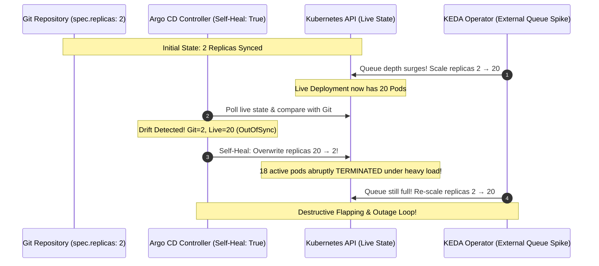
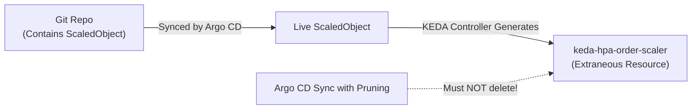

# Lesson 0026: KEDA and Argo CD replica drift resolution

## 1. The GitOps replica conflict

When integrating **KEDA** (or any Kubernetes autoscaler) into a **GitOps workflow with Argo CD**, a conflict emerges between declarative desired state and dynamic autoscaling:



### Why this conflict occurs
1. **Git is the source of truth:** Your Git repository specifies `spec.replicas: 2`.
2. **KEDA mutates the live object:** When external events arrive, KEDA (or its managed HPA) mutates the live Deployment's `spec.replicas` to `20`.
3. **Argo CD flags drift:** Argo CD compares Git against live cluster state, detects that `2 != 20`, marks the application as **`OutOfSync`**, and (if `selfHeal: true` is enabled) overwrites the live replica count back to `2`.

---

## 2. Production resolution patterns

### Pattern 1: ignoreDifferences in Argo CD (Recommended)

Instruct Argo CD to ignore mutations made to the `/spec/replicas` field of target workloads.

#### Option A: Application-level configuration
Add `ignoreDifferences` directly to your Argo CD `Application` manifest:

```yaml
apiVersion: argoproj.io/v1alpha1
kind: Application
metadata:
  name: payment-processor
  namespace: argocd
spec:
  project: default
  source:
    repoURL: https://github.com/my-org/gitops-apps.git
    targetRevision: HEAD
    path: apps/payment-processor
  destination:
    server: https://kubernetes.default.svc
    namespace: payments
  syncPolicy:
    automated:
      prune: true
      selfHeal: true                  # Safe to keep enabled
  ignoreDifferences:
    - group: apps
      kind: Deployment
      name: payment-worker            # Optional: omit to apply to all Deployments in app
      jsonPointers:
        - /spec/replicas
```

#### Option B: Global system configuration
To apply this across all autoscaled Deployments globally, configure `argocd-cm`:

```yaml
apiVersion: v1
kind: ConfigMap
metadata:
  name: argocd-cm
  namespace: argocd
data:
  resource.customizations.ignoreDifferences.apps_Deployment: |
    jsonPointers:
      - /spec/replicas
```

---

### Pattern 2: Omitting spec.replicas from Git manifests

In Kubernetes, `spec.replicas` on a `Deployment` defaults to `1` when omitted during creation.

If you **omit `spec.replicas` entirely** from your YAML manifest in Git:
```yaml
apiVersion: apps/v1
kind: Deployment
metadata:
  name: payment-worker
spec:
  # Do not declare replicas key here
  selector:
    matchLabels:
      app: payment-worker
  template:
    metadata:
      labels:
        app: payment-worker
    spec:
      containers:
        - name: worker
          image: my-registry/worker:v2.1.0
```

#### Why this works
When Argo CD computes a 3-way merge patch, it compares only fields defined in Git. Because `spec.replicas` is not defined in Git, Argo CD ignores the live value written by KEDA.

---

## 3. Managing auto-generated HPAs

When you create a `ScaledObject`, KEDA generates an underlying `HorizontalPodAutoscaler` object (named `keda-hpa-<scaledobject-name>`).



### Preventing Argo CD from pruning KEDA's HPA
1. **Do not commit a separate HPA in Git** if you already declare a KEDA `ScaledObject`. Having both causes two controllers to compete over the same deployment.
2. KEDA assigns an `ownerReference` pointing to the parent `ScaledObject`. Argo CD respects this owner reference and will not prune the child HPA.
3. If needed, configure Argo CD to ignore extraneous resources:
   ```yaml
   metadata:
     annotations:
       argocd.argoproj.io/compare-options: IgnoreExtraneous
   ```

---

## 4. KEDA integration with Argo Rollouts

For canary and blue-green rollouts, KEDA scales the `Rollout` Custom Resource (`argoproj.io/v1alpha1`):

```yaml
apiVersion: keda.sh/v1alpha1
kind: ScaledObject
metadata:
  name: web-rollout-scaler
  namespace: frontend
spec:
  scaleTargetRef:
    apiVersion: argoproj.io/v1alpha1
    kind: Rollout                     # Target the Rollout CRD directly
    name: web-app
  minReplicaCount: 2
  maxReplicaCount: 50
  triggers:
    - type: prometheus
      metadata:
        serverAddress: http://prometheus.monitoring.svc:9090
        metricName: http_requests_total
        query: sum(rate(http_requests_total{app="web-app"}[1m]))
        threshold: '50'
```

In the Argo CD `Application`, ignore `spec.replicas` on the `Rollout`:
```yaml
ignoreDifferences:
  - group: argoproj.io
    kind: Rollout
    jsonPointers:
      - /spec/replicas
```

---

## Test your knowledge

1. What causes the destructive flapping cycle between Argo CD self-heal and KEDA?
   - [ ] A) Argo CD reverts live replica changes because Git declares static replica counts
   - [ ] B) KEDA operator crashes when Prometheus external queries exceed timeout limits
   
   Answer: A. When Git specifies static replicas, Argo CD's self-healing reconciler treats dynamic scaling as unauthorized drift and resets the replica count.

2. What is the recommended Argo CD configuration to permit KEDA autoscaling while maintaining automated GitOps self-healing?
   - [ ] A) Configure ignoreDifferences on /spec/replicas for the target Deployment
   - [ ] B) Disable cluster RBAC permissions on the Argo CD application controller
   
   Answer: A. `ignoreDifferences` tells Argo CD to exclude the `spec.replicas` path from drift calculation, allowing KEDA to control replica counts.

---

## Hands-on practice: Configuring and validating ignoreDifferences

### Step 1: Check live sync status via Argo CD CLI
```bash
# View application status
argocd app get payment-processor

# Inspect the exact difference detected by Argo CD
argocd app diff payment-processor
```

### Step 2: Apply the ignoreDifferences configuration
```bash
# Verify the Application CRD has ignoreDifferences configured
kubectl get application payment-processor -n argocd -o yaml | grep -A 5 ignoreDifferences

# Observe that Argo CD reports the Application as Synced
argocd app get payment-processor
```

---

## Recommended primary resources
- [Argo CD resource drift diffing](https://argo-cd.readthedocs.io/en/stable/user-guide/diffing/)
- [KEDA scaling Deployments and Custom Resources](https://keda.sh/docs/latest/concepts/scaling-deployments/)

---

[← Lesson 25: Scheduled autoscaling with Cron scalers and multi-trigger composition](./0025-keda-cron-and-scheduled-scaling.md) | [Lesson 27: Batch processing with ScaledJobs and workload identity →](./0027-keda-scaledjobs-and-batch-processing.md)
