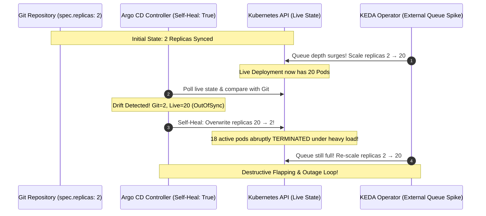
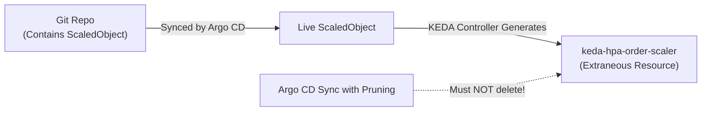

# Lesson 26: Solving the GitOps Tug-of-War: KEDA + Argo CD Drift & Conflict Resolution

## 1. The GitOps Tug-of-War Dilemma

When integrating **KEDA** (or any Kubernetes autoscaler) into a **GitOps workflow with Argo CD**, a critical architectural conflict arises: **the Replicas Tug-of-War**.



### Why Does This Happen?
1. **Git is the Single Source of Truth:** Your Git repository defines `spec.replicas: 2`.
2. **KEDA Dynamically Mutates the Live Object:** When external events arrive, KEDA (or its managed HPA) mutates the live Deployment’s `spec.replicas` to `20`.
3. **Argo CD Flags Drift:** Argo CD compares Git against the live cluster state, detects that `2 != 20`, marks the application as **`OutOfSync`**, and (if `selfHeal: true` is enabled) aggressively overwrites the replica count back to `2`.

---

## 2. The Solutions: Production Patterns

To solve the Replicas Tug-of-War, platform teams implement one or more of the following standard GitOps patterns.

---

### Pattern 1: `ignoreDifferences` in Argo CD (Recommended)

The most robust and standard approach is instructing Argo CD to intentionally ignore mutations made to the `/spec/replicas` field of your workloads.

#### Option A: Application-Level Configuration
Add `ignoreDifferences` directly to your Argo CD `Application` manifest:

```yaml
apiVersion: argoproj.io/v1alpha1
kind: Application
metadata:
  name: payment-processor
  namespace: argocd
spec:
  project: default
  source:
    repoURL: https://github.com/my-org/gitops-apps.git
    targetRevision: HEAD
    path: apps/payment-processor
  destination:
    server: https://kubernetes.default.svc
    namespace: payments
  syncPolicy:
    automated:
      prune: true
      selfHeal: true                  # Safe to keep enabled now!
  ignoreDifferences:
    - group: apps
      kind: Deployment
      name: payment-worker            # Optional: omit to apply to all Deployments in app
      jsonPointers:
        - /spec/replicas
```

#### Option B: Global System-Wide Configuration
If you have hundreds of autoscaled microservices, you can configure `argocd-cm` once so that Argo CD globally ignores `spec.replicas` on all Deployments managed by HPAs/KEDA:

```yaml
apiVersion: v1
kind: ConfigMap
metadata:
  name: argocd-cm
  namespace: argocd
data:
  resource.customizations.ignoreDifferences.apps_Deployment: |
    jsonPointers:
      - /spec/replicas
```

---

### Pattern 2: Omitting `spec.replicas` from Git Manifests

In Kubernetes, the `spec.replicas` field on a `Deployment` is optional and defaults to `1` when first created.

If you **omit `spec.replicas` entirely** from your YAML manifest in Git:
```yaml
apiVersion: apps/v1
kind: Deployment
metadata:
  name: payment-worker
spec:
  # Do NOT declare `replicas: 1` here!
  selector:
    matchLabels:
      app: payment-worker
  template:
    metadata:
      labels:
        app: payment-worker
    spec:
      containers:
        - name: worker
          image: my-registry/worker:v2.1.0
```

#### Why This Works:
When Argo CD performs a 3-way strategic merge patch, it compares only the fields declared in Git. Because `spec.replicas` is not defined in Git, Argo CD ignores whatever value KEDA writes to `spec.replicas` in the live cluster.

---

## 3. Managing Auto-Generated HPAs & Extraneous Resources

When you create a `ScaledObject`, KEDA automatically generates an underlying `HorizontalPodAutoscaler` object (named `keda-hpa-<scaledobject-name>`).



### Preventing Argo CD from Deleting KEDA's HPA
Because the generated HPA does not exist in your Git repository, an overly aggressive Argo CD auto-prune policy might identify it as an "extraneous" resource.

1. **Never commit a manual HPA in Git** if you are already declaring a KEDA `ScaledObject`. Having both causes two controllers to fight over the same deployment.
2. KEDA assigns an `ownerReference` pointing to the parent `ScaledObject`. Argo CD recognizes this owner reference and will not prune the child HPA.
3. If necessary, you can annotate resources or configure Argo CD to ignore extraneous resources:
   ```yaml
   metadata:
     annotations:
       argocd.argoproj.io/compare-options: IgnoreExtraneous
   ```

---

## 4. KEDA Integration with Argo Rollouts

For progressive canary and blue/green deployments, KEDA seamlessly targets the `Rollout` Custom Resource (`argoproj.io/v1alpha1`):

```yaml
apiVersion: keda.sh/v1alpha1
kind: ScaledObject
metadata:
  name: web-rollout-scaler
  namespace: frontend
spec:
  scaleTargetRef:
    apiVersion: argoproj.io/v1alpha1
    kind: Rollout                     # Target the Rollout CRD directly!
    name: web-app
  minReplicaCount: 2
  maxReplicaCount: 50
  triggers:
    - type: prometheus
      metadata:
        serverAddress: http://prometheus.monitoring.svc:9090
        metricName: http_requests_total
        query: sum(rate(http_requests_total{app="web-app"}[1m]))
        threshold: '50'
```

And in your Argo CD `Application`, ignore `spec.replicas` on the `Rollout` resource:
```yaml
ignoreDifferences:
  - group: argoproj.io
    kind: Rollout
    jsonPointers:
      - /spec/replicas
```

---

## Test Your Knowledge

1. What causes the destructive flapping cycle between Argo CD self-heal and KEDA?
   - [ ] A) Argo CD reverts live replica changes because Git declares static replica counts
   - [ ] B) KEDA operator crashes when Prometheus external queries exceed timeout limits
   
   *Answer:* A) Argo CD reverts live replica changes because Git declares static replica counts - Correct! When Git specifies static replicas, Argo CD's self-healing reconciler treats KEDA's dynamic scaling as unauthorized drift and resets the replica count.

2. What is the recommended Argo CD configuration to permit KEDA autoscaling while maintaining automated GitOps self-healing?
   - [ ] A) Configure ignoreDifferences on /spec/replicas for the target Deployment
   - [ ] B) Disable cluster RBAC permissions on the Argo CD application controller
   
   *Answer:* A) Configure ignoreDifferences on /spec/replicas for the target Deployment - Correct! `ignoreDifferences` tells Argo CD to exclude the `spec.replicas` path from drift calculation, allowing KEDA full autonomy over replica scaling.

---

## Interactive Win: Configuring and Validating Drift Ignorance

Let's verify how Argo CD treats an autoscaled Deployment before and after configuring `ignoreDifferences`.

### Step 1: Check Live Sync Status via Argo CD CLI
```bash
# View application status - notice if it is OutOfSync due to replica count
argocd app get payment-processor

# Inspect the exact difference detected by Argo CD
argocd app diff payment-processor
```

### Step 2: Apply the `ignoreDifferences` Patch
```bash
# Verify the Application CRD has ignoreDifferences configured
kubectl get application payment-processor -n argocd -o yaml | grep -A 5 ignoreDifferences

# Observe that Argo CD immediately reports the Application as Synced (Healthy)
argocd app get payment-processor
```

---

## Recommended Primary Resource
- [Argo CD Official Guide: Ignoring Resource Drift](https://argo-cd.readthedocs.io/en/stable/user-guide/diffing/)
- [KEDA Scaling Deployments, StatefulSets & Custom Resources](https://keda.sh/docs/latest/concepts/scaling-deployments/)

---
**Encountering drift issues with other dynamic fields (e.g. annotations or certs)?** Ask in the chat, and we'll configure targeted JSON pointer diff exceptions!

[← Lesson 25: Time-Based & Cron Scaling](./0025-keda-cron-and-scheduled-scaling.md) | [Lesson 27: ScaledJobs & Batch Processing →](./0027-keda-scaledjobs-and-batch-processing.md)
