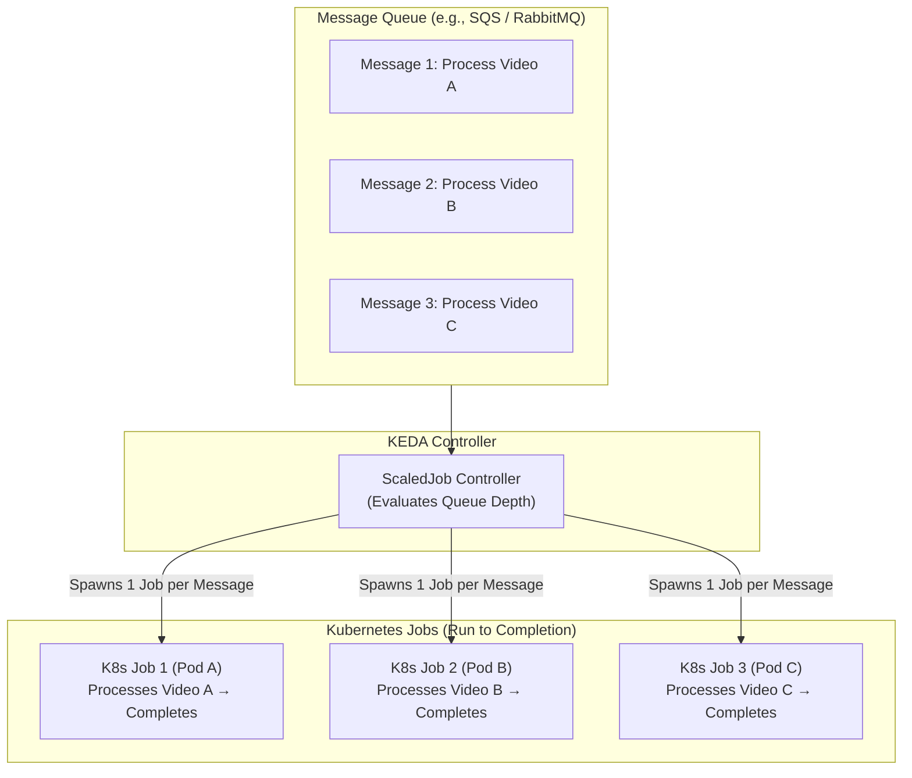
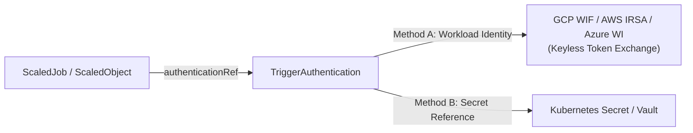

# Lesson 27: Event-Driven Batch Processing with KEDA ScaledJobs & Secure Authentication

## 1. When to Use `ScaledJob` vs. `ScaledObject`

So far, we have scaled long-running servers using `ScaledObject` (Deployments, StatefulSets, and Argo Rollouts). However, many workloads are **discrete, run-to-completion batch tasks**:
- **Video & Media Transcoding:** 1 video uploaded = 1 discrete transcoding Job.
- **Large Language Model (LLM) & AI Batch Inference:** Processing heavy document embeddings.
- **Nightly Financial Settlement:** Generating reports for each registered merchant.
- **Dead-Letter Queue (DLQ) Reprocessing:** Replaying failed transactions one-by-one.

For these use cases, keeping warm pods running is wasteful. Instead, KEDA’s **`ScaledJob` CRD** dynamically spawns native Kubernetes `Job` objects that run to completion and terminate.



---

## 2. Declarative `ScaledJob` Blueprint

Here is a production `ScaledJob` that monitors an AWS SQS queue and spawns video transcoding jobs:

```yaml
apiVersion: keda.sh/v1alpha1
kind: ScaledJob
metadata:
  name: video-transcoder-scaledjob
  namespace: media-processing
spec:
  jobTargetRef:
    parallelism: 1                    # Pods per single job execution
    completions: 1                    # Successful pod runs needed to finish
    activeDeadlineSeconds: 1800       # Kill job if execution exceeds 30 minutes
    backoffLimit: 2                   # Max retries before marking job failed
    template:
      spec:
        restartPolicy: Never
        containers:
          - name: transcoder
            image: my-registry/video-transcoder:v1.4.0
            resources:
              requests:
                cpu: "2"
                memory: 4Gi
  pollingInterval: 10                 # Check SQS queue every 10 seconds
  maxReplicaCount: 50                 # Never exceed 50 concurrent active jobs
  successfulJobsHistoryLimit: 5       # Keep last 5 completed jobs for logs
  failedJobsHistoryLimit: 10          # Keep last 10 failed jobs for debugging
  scalingStrategy:
    strategy: "accurate"              # 'default' or 'accurate' calculation
    targetWorkload: "1"               # 1 Job per 1 message in queue
  triggers:
    - type: aws-sqs-queue
      metadata:
        queueURL: https://sqs.us-east-1.amazonaws.com/123456789012/video-uploads
        queueLength: "1"
        awsRegion: "us-east-1"
      authenticationRef:
        name: keda-aws-credentials    # Reference to TriggerAuthentication
```

---

## 3. Secure Scaler Credentials: `TriggerAuthentication`

Hardcoding credentials or access keys inside `ScaledObject` or `ScaledJob` manifests violates security best practices and exposes secrets in Git.

KEDA provides the **`TriggerAuthentication`** (namespace-scoped) and **`ClusterTriggerAuthentication`** (cluster-scoped) CRDs to decouple authentication.



### Pattern A: Keyless Cloud Workload Identity (GCP WIF / AWS IRSA)
In modern cloud clusters (GKE, EKS, AKS), the most secure approach uses **Workload Identity** so no static credentials ever touch the cluster.

```yaml
apiVersion: keda.sh/v1alpha1
kind: TriggerAuthentication
metadata:
  name: keda-gcp-credentials
  namespace: media-processing
spec:
  podIdentity:
    provider: gcp                     # Keyless GCP Workload Identity
```

### Pattern B: Kubernetes Secret Reference
If using API tokens or database passwords:

```yaml
apiVersion: keda.sh/v1alpha1
kind: TriggerAuthentication
metadata:
  name: keda-db-credentials
  namespace: analytics
spec:
  secretTargetRef:
    - parameter: connectionString     # Name expected by the KEDA scaler
      name: postgres-secret           # Kubernetes Secret name
      key: DB_CONNECTION_URL          # Key inside the Secret
```

---

## 4. Production Resilience & Cleanups

When designing event-driven batch jobs, enforce these best practices:

1. **Set `successfulJobsHistoryLimit` & `failedJobsHistoryLimit`:** Kubernetes stores finished Job metadata in `etcd`. Failing to set history limits will accumulate thousands of dead Job objects and degrade API server performance.
2. **Set `activeDeadlineSeconds`:** Prevents rogue or hanging batch jobs from running indefinitely and exhausting cluster compute or cloud budgets.
3. **Idempotency & Dead-Letter Queues (DLQ):** Ensure batch jobs can safely retry without creating duplicate side-effects (e.g. charging a credit card twice). If a message crashes a job repeatedly, move it to a DLQ.

---

## Test Your Knowledge

1. When should you choose a `ScaledJob` instead of a `ScaledObject`?
   - [ ] A) For discrete batch tasks that process an event and run to completion
   - [ ] B) For long-running HTTP microservices that accept live incoming connections
   
   *Answer:* A) For discrete batch tasks that process an event and run to completion - Correct! `ScaledJob` is engineered for run-to-completion batch workloads (e.g., video transcoding, report generation), whereas `ScaledObject` manages long-running servers.

2. Why is using `TriggerAuthentication` with Cloud Workload Identity preferred over static API keys in GitOps?
   - [ ] A) It eliminates static credentials and uses short-lived cryptographic tokens
   - [ ] B) It automatically compiles application source code before scaling pods
   
   *Answer:* A) It eliminates static credentials and uses short-lived cryptographic tokens - Correct! Workload Identity (GCP WIF, AWS IRSA) allows KEDA to authenticate to external cloud APIs keylessly without storing plaintext secrets in Git.

---

## Interactive Win: Inspecting ScaledJobs & Job History

### Step 1: Check ScaledJob Status
```bash
# List all ScaledJobs and inspect active job counts
kubectl get scaledjobs -n media-processing

# Output should show:
# NAME                         ACTIVE   READY   AGE
# video-transcoder-scaledjob   3        True    10m
```

### Step 2: Inspect Generated Kubernetes Jobs
```bash
# List active and completed jobs spawned by KEDA
kubectl get jobs -n media-processing -l app.kubernetes.io/managed-by=keda-operator
```

---

## Module 4 Summary Checklist

Congratulations on completing **Module 4: Event-Driven Autoscaling with KEDA & GitOps Synchronization**! You have mastered:

- [x] **KEDA Architecture:** Operator, external metrics adapter, and scale-to-zero mechanics ([Lesson 23](0023-keda-fundamentals-and-architecture.md)).
- [x] **External Metric Scalers:** Prometheus PromQL, Kafka lag, RabbitMQ, and fallback resilience ([Lesson 24](0024-keda-external-metrics-scalers.md)).
- [x] **Time-Based Scheduling:** Timezone-aware Cron scalers and multi-trigger MAX evaluation ([Lesson 25](0025-keda-cron-and-scheduled-scaling.md)).
- [x] **GitOps Drift Resolution:** Solving the Replicas Tug-of-War with Argo CD `ignoreDifferences` and Rollouts ([Lesson 26](0026-keda-argocd-gitops-integration-and-drift.md)).
- [x] **Batch Processing & Security:** Discrete `ScaledJobs` and keyless `TriggerAuthentication` ([Lesson 27](0027-keda-scaledjobs-and-batch-processing.md)).

---

## Recommended Primary Resource
- [KEDA ScaledJob Specification](https://keda.sh/docs/latest/concepts/scaling-jobs/)
- [KEDA TriggerAuthentication Reference](https://keda.sh/docs/latest/concepts/authentication/)

---
**Building an event-driven platform or scaling batch ML workloads?** Ask in the chat, and we'll help design your end-to-end architecture!

[← Lesson 26: KEDA + Argo CD Drift Resolution](./0026-keda-argocd-gitops-integration-and-drift.md) | [Return to Lessons Overview →](./index.md)
