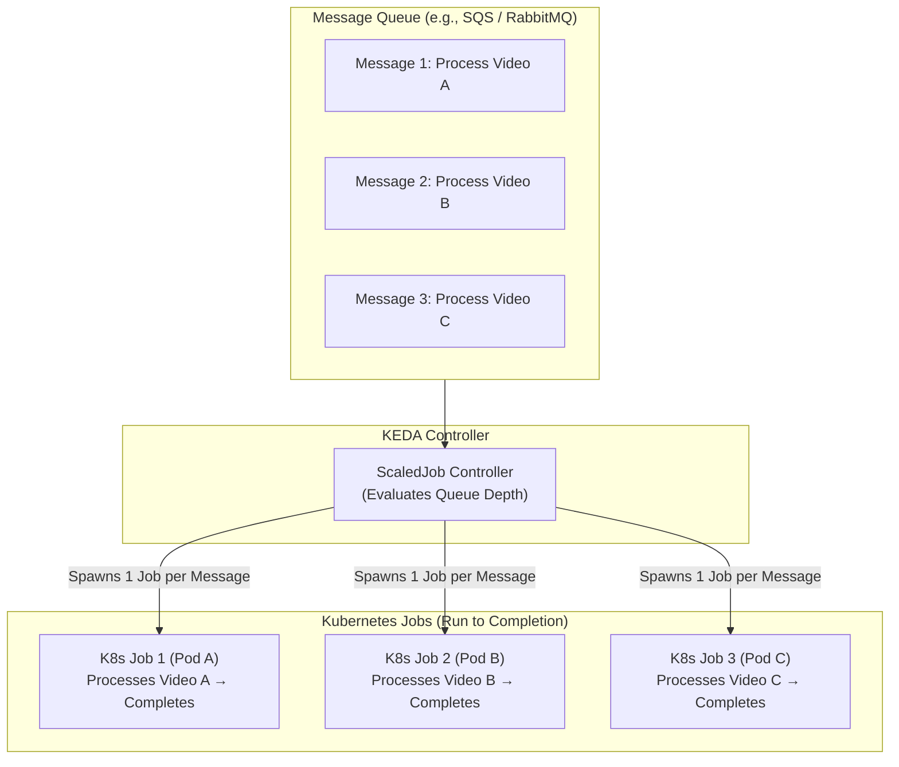
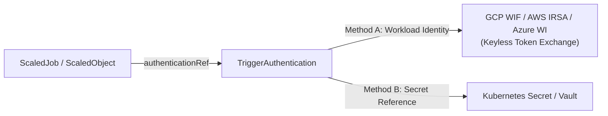

# Lesson 0027: Batch processing with ScaledJobs and workload identity

## 1. When to use ScaledJob versus ScaledObject

`ScaledObject` manages long-running workloads (Deployments, StatefulSets, Argo Rollouts). However, many workloads are **discrete, run-to-completion batch tasks**:
- **Media transcoding:** 1 video uploaded = 1 discrete transcoding Job.
- **Batch inference:** Processing document batches or embeddings.
- **Scheduled settlements:** Generating daily reports per merchant.
- **Dead-letter queue (DLQ) processing:** Processing failed messages individually.

For these workloads, maintaining idle pods consumes unnecessary resources. KEDA's **`ScaledJob` CRD** spawns native Kubernetes `Job` objects that run to completion and exit.



---

## 2. Declarative ScaledJob blueprint

Below is a production `ScaledJob` that monitors an AWS SQS queue and spawns batch processing jobs:

```yaml
apiVersion: keda.sh/v1alpha1
kind: ScaledJob
metadata:
  name: video-transcoder-scaledjob
  namespace: media-processing
spec:
  jobTargetRef:
    parallelism: 1                    # Pods per single job execution
    completions: 1                    # Successful pod runs needed to finish
    activeDeadlineSeconds: 1800       # Kill job if execution exceeds 30 minutes
    backoffLimit: 2                   # Max retries before marking job failed
    template:
      spec:
        restartPolicy: Never
        containers:
          - name: transcoder
            image: my-registry/video-transcoder:v1.4.0
            resources:
              requests:
                cpu: "2"
                memory: 4Gi
  pollingInterval: 10                 # Check SQS queue every 10 seconds
  maxReplicaCount: 50                 # Never exceed 50 concurrent active jobs
  successfulJobsHistoryLimit: 5       # Keep last 5 completed jobs for logs
  failedJobsHistoryLimit: 10          # Keep last 10 failed jobs for debugging
  scalingStrategy:
    strategy: "accurate"              # 'default' or 'accurate' calculation
    targetWorkload: "1"               # 1 Job per 1 message in queue
  triggers:
    - type: aws-sqs-queue
      metadata:
        queueURL: https://sqs.us-east-1.amazonaws.com/123456789012/video-uploads
        queueLength: "1"
        awsRegion: "us-east-1"
      authenticationRef:
        name: keda-aws-credentials    # Reference to TriggerAuthentication
```

---

## 3. Secure scaler credentials: TriggerAuthentication

Hardcoding credentials or API keys inside `ScaledObject` or `ScaledJob` manifests creates security risks and commits secrets into version control.

KEDA provides **`TriggerAuthentication`** (namespace-scoped) and **`ClusterTriggerAuthentication`** (cluster-scoped) to manage authentication externally.



### Pattern A: Keyless cloud Workload Identity (GCP WIF / AWS IRSA)
In cloud environments (GKE, EKS, AKS), Workload Identity exchanges short-lived tokens without storing static credentials:

```yaml
apiVersion: keda.sh/v1alpha1
kind: TriggerAuthentication
metadata:
  name: keda-gcp-credentials
  namespace: media-processing
spec:
  podIdentity:
    provider: gcp                     # Keyless GCP Workload Identity
```

### Pattern B: Kubernetes Secret reference
For systems using API tokens or database connection strings:

```yaml
apiVersion: keda.sh/v1alpha1
kind: TriggerAuthentication
metadata:
  name: keda-db-credentials
  namespace: analytics
spec:
  secretTargetRef:
    - parameter: connectionString     # Name expected by the KEDA scaler
      name: postgres-secret           # Kubernetes Secret name
      key: DB_CONNECTION_URL          # Key inside the Secret
```

---

## 4. Production resilience and cleanup

1. **Configure `successfulJobsHistoryLimit` and `failedJobsHistoryLimit`:** Kubernetes stores completed Job records in `etcd`. Omitting history limits causes dead Job objects to accumulate, increasing API server memory usage.
2. **Set `activeDeadlineSeconds`:** Prevents hanging batch processes from running indefinitely.
3. **Idempotency and Dead-Letter Queues (DLQ):** Ensure batch jobs can retry safely without duplicate side effects. If a poisoned message repeatedly fails processing, route it to a DLQ.

---

## Test your knowledge

1. When should you choose a `ScaledJob` instead of a `ScaledObject`?
   - [ ] A) For discrete batch tasks that process an event and run to completion
   - [ ] B) For long-running HTTP microservices that accept live incoming connections
   
   Answer: A. `ScaledJob` is designed for run-to-completion batch workloads (such as media processing and report generation), whereas `ScaledObject` manages persistent server processes.

2. Why is using `TriggerAuthentication` with Cloud Workload Identity preferred over static API keys in GitOps?
   - [ ] A) It eliminates static credentials and uses short-lived cryptographic tokens
   - [ ] B) It automatically compiles application source code before scaling pods
   
   Answer: A. Workload Identity (GCP WIF, AWS IRSA) allows KEDA to authenticate to cloud APIs keylessly without storing plaintext secrets in Git.

---

## Hands-on practice: Inspecting ScaledJobs and job history

### Step 1: Check ScaledJob status
```bash
# List all ScaledJobs and inspect active job counts
kubectl get scaledjobs -n media-processing

# Output should show:
# NAME                         ACTIVE   READY   AGE
# video-transcoder-scaledjob   3        True    10m
```

### Step 2: Inspect generated Kubernetes Jobs
```bash
# List active and completed jobs spawned by KEDA
kubectl get jobs -n media-processing -l app.kubernetes.io/managed-by=keda-operator
```

---

## Module 4 review checklist

Key autoscaling and GitOps concepts covered in Module 4:

- [x] **KEDA architecture:** Operator, external metrics adapter, and scale-to-zero mechanics ([Lesson 23](0023-keda-fundamentals-and-architecture.md)).
- [x] **External metric scalers:** Prometheus PromQL, Kafka lag, RabbitMQ, and fallback resilience ([Lesson 24](0024-keda-external-metrics-scalers.md)).
- [x] **Scheduled autoscaling:** Timezone-aware Cron scalers and multi-trigger MAX evaluation ([Lesson 25](0025-keda-cron-and-scheduled-scaling.md)).
- [x] **GitOps drift resolution:** Resolving replica conflicts with Argo CD `ignoreDifferences` and Rollouts ([Lesson 26](0026-keda-argocd-gitops-integration-and-drift.md)).
- [x] **Batch processing and security:** Discrete `ScaledJobs` and keyless `TriggerAuthentication` ([Lesson 27](0027-keda-scaledjobs-and-batch-processing.md)).

---

## Recommended primary resources
- [KEDA ScaledJob specification](https://keda.sh/docs/latest/concepts/scaling-jobs/)
- [KEDA TriggerAuthentication reference](https://keda.sh/docs/latest/concepts/authentication/)

---

[← Lesson 26: KEDA and Argo CD replica drift resolution](./0026-keda-argocd-gitops-integration-and-drift.md) | [Return to lessons overview →](./index.md)
