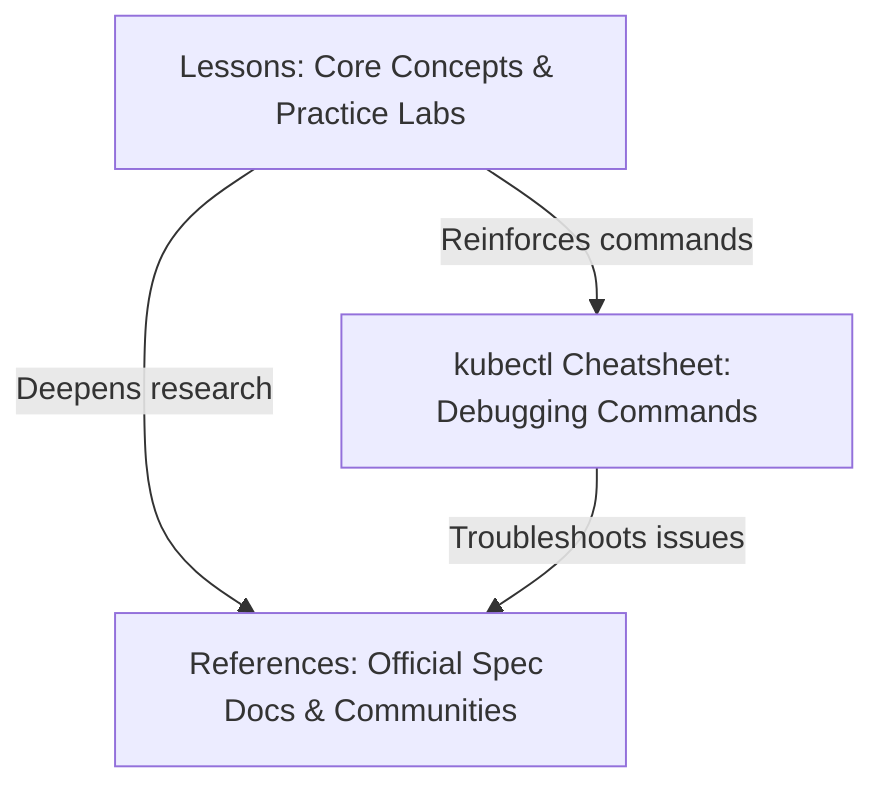

# References

A collection of external links, documentation, and tools to assist you with Kubernetes.

### Learning Ecosystem Map

## Official Resources

* **[Kubernetes Official Documentation](https://kubernetes.io/docs/)** - The ultimate guide and reference source.
* **[Kubernetes API Reference](https://kubernetes.io/docs/reference/kubernetes-api/)** - Complete specification of the Kubernetes API resources.
* **[Kubernetes Blog](https://kubernetes.io/blog/)** - Latest updates, releases, and articles from the community.

---

## Local Development Tools

For learning and testing Kubernetes locally, you can use these light-weight Kubernetes distributions:

* **[Minikube](https://minikube.sigs.k8s.io/)** - Runs a single-node Kubernetes cluster inside a VM or container on your local machine.
* **[Kind (Kubernetes in Docker)](https://kind.sigs.k8s.io/)** - Runs local Kubernetes clusters using Docker container "nodes".
* **[K3s](https://k3s.io/)** - Highly available, certified Kubernetes distribution designed for production workloads in resource-constrained, remote, IoT, or edge environments.

---

## Clients & Cluster Visualizers

Tools to help you explore and manage your cluster without typing every `kubectl` command manually:

* **[k9s](https://k9scli.io/)** - A terminal-based UI to interact with your Kubernetes clusters.
* **[Lens](https://k8slens.dev/)** - A powerful desktop IDE for Kubernetes clusters, providing real-time visualization and metrics.

!!! info "Highly Recommended"
    For terminal lovers, **[k9s](https://k9scli.io/)** is highly recommended as it is fast, keyboard-driven, and provides real-time information on pod status and logs.

---

## Additional Resources

* **[Kubernetes Resources](resources.md)**: Additional knowledge and wisdom sources (GKE docs, VMware Academy, CNCF slack, subreddit).
